## IDEA概述

​	IDEA全称IntelliJ IDEA，是用于Java语言开发的集成环境，它是业界公认的目前用于Java程序开发最好的工具。

> **集成环境：**
>
> ​	把代码编写，编译，执行，调试等多种功能综合到一起的开发工具。

### 为什么要学习IDEA

​	IDEA所属公司JetBrains旗下拥有众多常用的开发工具，未来我们学的python会使用pycharm，前端用webstorm，大数据开发时会采用Datagrip。众多工具拥有相似的界面和快捷键，使用方式极其相似。所以自此，我们要开始尝试从Eclipse切换到IDEA中。

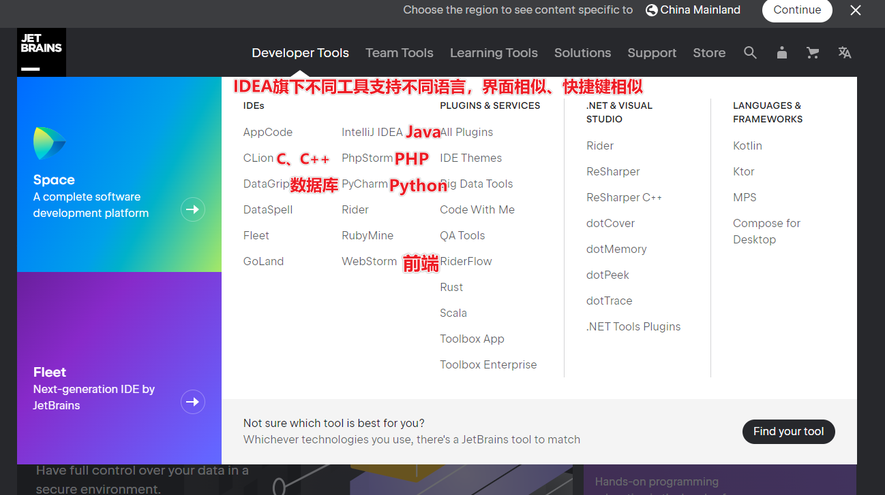

## IDEA的下载和安装

### 下载

​	可以到官方网站自行下载，网址为：https://www.jetbrains.com/idea。

**版本区别：**

社区版：免费，JavaSE阶段下载这个即可

旗舰版：试用期30天，之后需要购买。学生可以使用edu邮箱认证之后，免费使用。

exe：需要一步步安装

zip：直接解压即可使用

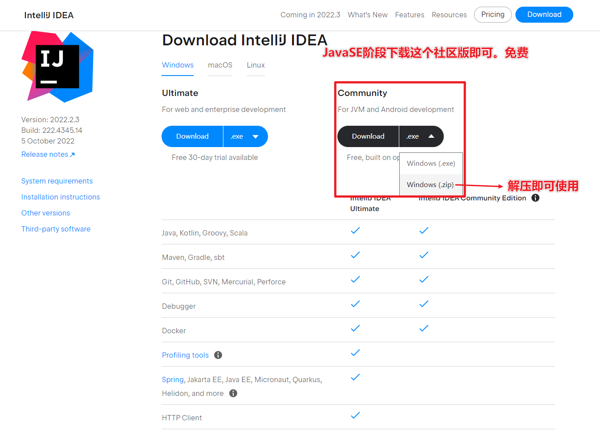

### exe版安装

- 到资料文件夹中，双击安装包。
- 点击next，准备安装

- 点击Browse修改安装路径。

  修改完毕点击next

- 勾选64-bit launcher。表示在桌面新建一个64位的快捷方式。

  其他的不要勾选。

  点击next。

- 点击Install，准备安装。

- 等进度条读取完毕之后，会有最终界面提示。

  点击finish即可。

- 第一次启动会询问，是否导入一些设置。

  选择第二个不导入，保持默认设置，再点击OK。

- 选择背景主题

  左边是黑色背景。右边是白色背景。

  这个可以根据自己的喜好来选择。

  选择完毕点击右下角的next

- 在本界面让我们购买idea。

  因为我们是学习阶段，所以可以使用免费使用30天。

  点击第一排第二个。Evaluate for free

- 点击蓝色的Evaluate，就可以开始免费试用30天了。

- 当看到这个界面，就表示idea已经成功安装完毕

  可以点击右上角关闭。

### zip版安装-【推荐】

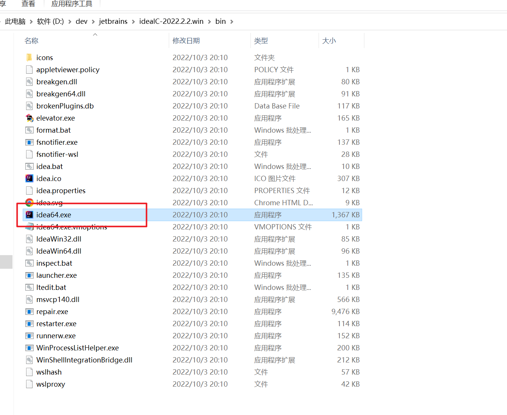

## IDEA基本设置

### 打开设置窗口

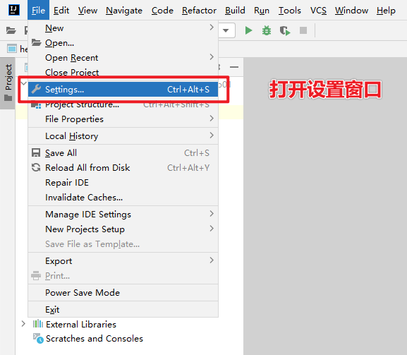

### 统一编码

### 设置字体

### 滚轮调节字体大小

### 快捷按钮打开

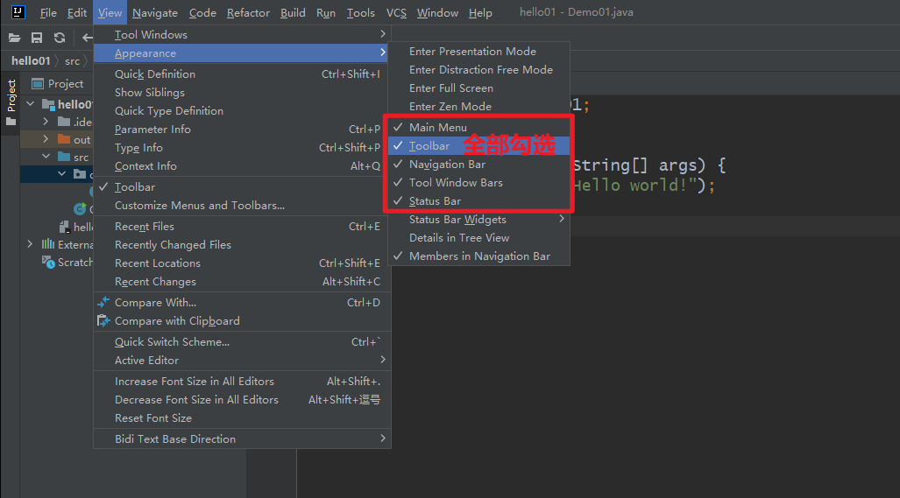

### 主题切换

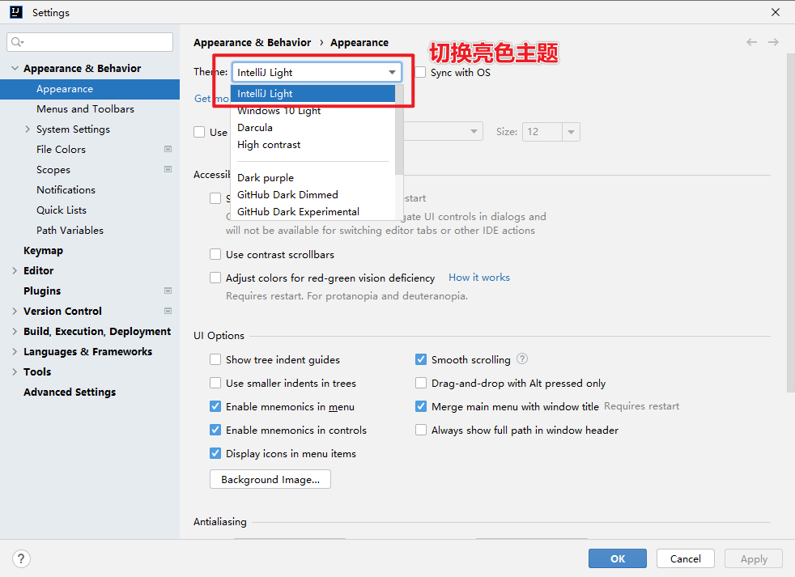

## IDEA中层级结构介绍

### 结构分类

- project（项目、工程）
- module（模块）
- package（包）
- class（类）

### 结构介绍

​	为了让大家更好的吸收，package这一层级，我们后面再学习，先学习最基础的project、module、class。

**project（项目、工程）**

​	淘宝、京东、百度网站都属于一个个项目，IDEA中就是一个个的Project。

**module（模块）**

​	在一个项目中，可以存放多个模块，不同的模块可以存放项目中不同的业务功能代码。在百度中，至少包含了以下模块：

- 搜索模块
- 贴吧模块

为了更好的管理代码，我们会把代码分别放在两个模块中存放。

**package（包）**

​	一个模块中又有很多的业务，以百度网站的论坛模块为例，至少包含了以下不同的业务。

- 发帖
- 评论

为了把这些业务区分的更加清楚，就会用包来管理这些不同的业务。

**class（类）**

​	就是真正写代码的地方。

### 小结

- 层级关系

  ​	project - module - package - class

- 包含数量

  ​	project中可以创建多个module
  ​	module中可以创建多个package
  ​	package中可以创建多个class

  ​	这些结构的划分，是为了方便管理类文件的。

## IDEA中的第一个代码

### 操作步骤

- 创建Project 项目
- 创建Module 模块
- 创建class   类
- 在类中编写代码
- 完成编译运行

### 分步图解

- 首先要新建一个项目

  点击creat new project

  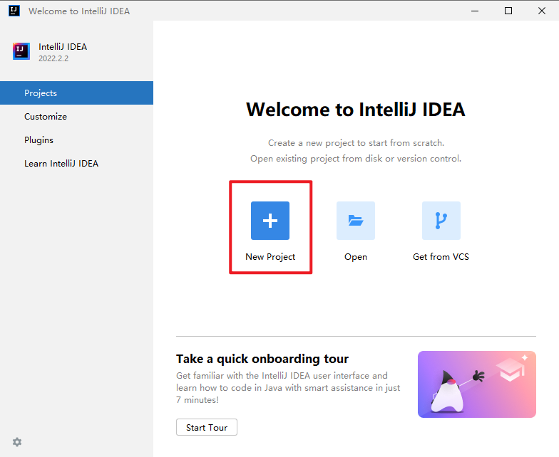

- 我们要从0开始写代码，所以新建一个空的什么都没有的项目。

  点击左侧的Empty Project

  输入项目的名称
  
  输入项目的存放路径

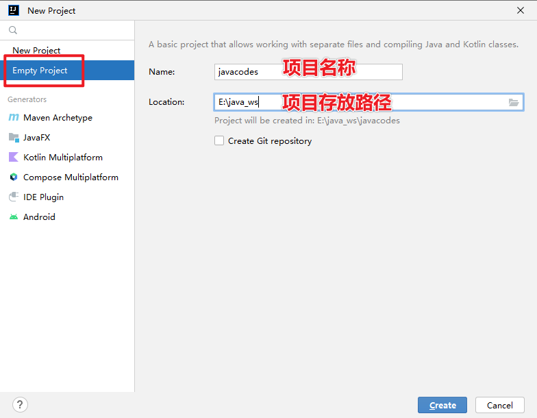

- 点击Create。idea会帮助我们在本地创建一个项目文件夹

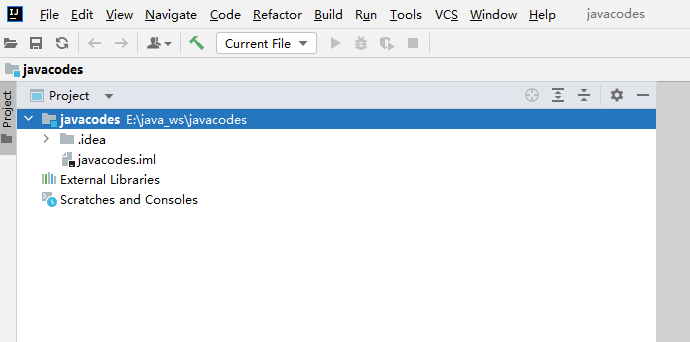

- 在项目名上点击鼠标右键，准备新建一个模块

  

- 我们要编写Java代码，所以要新建一个Java模块。

  - 输入模块的名称

  - 选择开发语言
  
  - 指定JDK版本

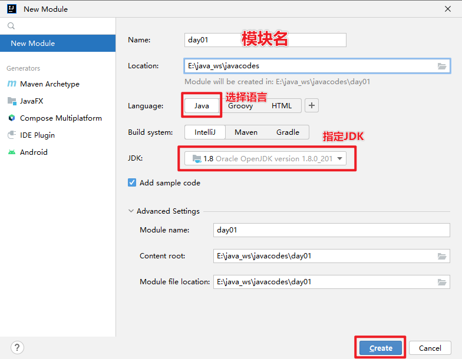

- 回到主界面

  展开刚刚新建的模块

  右键点击src，选择New，选择Java Class

- 输入类名

  再按回车

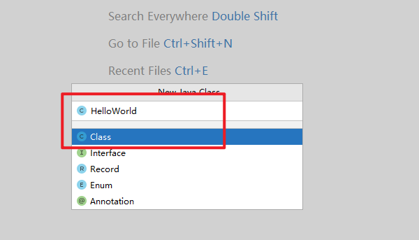

- 编写代码

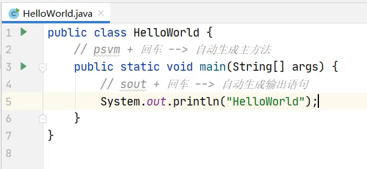

- 运行代码

  
  
  方式一：
  
  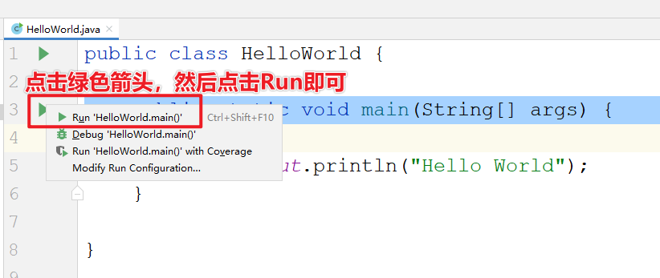
  
  
  
  方式二：
  
  右键代码空白处，点击Run

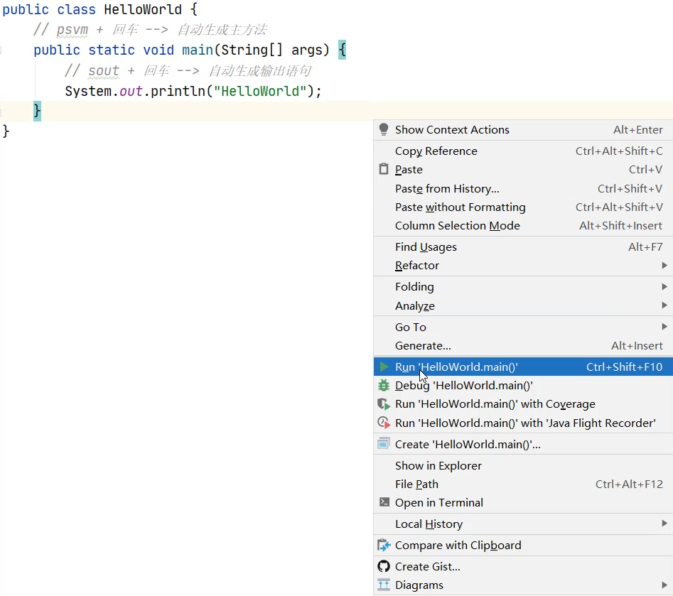

​		方式三：

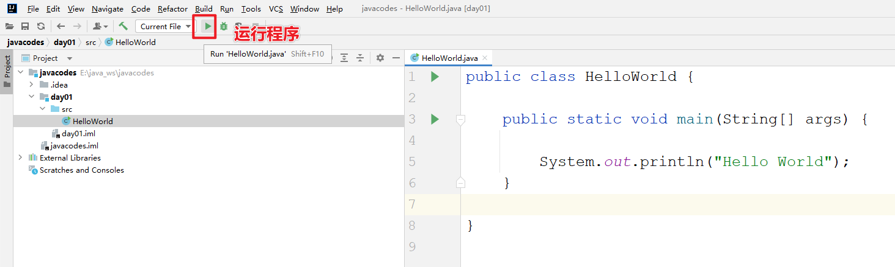

​	方式四：

​		组合键：CTRL+SHIFT+F10

- 最下面会弹出控制台。

  所有输出语句中的内容，都会在控制台上展示。

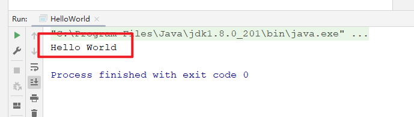

## IDEA中类的相关操作

### 类的相关操作

- 新建类文件
- 删除类文件
- 修改类文件

### 新建类文件

- 所有的Java代码都会写在src文件夹当中。

  所以，右键点击src，选择new，点击Java Class

  

- 输入类名，再按回车

  

- 新建完毕

### 修改类名

- 右键点击想要修改的文件

  点击Refactor

  再点击Rename

- 输入想要修改的名字

  输入完毕点击下面的Refactor

- 文件名和类名均已修改成功

  

### 删除类文件

- 想要删除哪个文件，就右键点击该文件

  选择Delete即可

- 在弹出的界面中点击OK，确定删除

> 小贴士：
>
> 此时删除是不走回收站的，直接从硬盘中删掉了。

## IDEA中模块的相关操作

### 模块的相关操作

- 新建模块
- 删除模块
- 修改模块
- 导入模块

### 新建模块

- 点击File，选择Project Structure

- 选择Module

- 点击+

  选择New Module

- 要创建一个Java模块，所以选择第一个Java

  点击右下角的Next

- 输入模块的名称

  点击右下角的Finish

- 成功新建完毕之后，在中间空白区域就出现了刚刚新建的模块

  点击右下角的OK

- 在主界面中，也会出现刚刚新建的模块

### 删除模块

- 右键点击模块

  选择Remove Module

- 选择Remove，表示确定删除

- 此时发现，在IDEA列表页面，删除的模块已经不在了。

> 小贴士：
>
> 此时删除仅仅是从IDEA列表中的删除，在本地硬盘中还是存在的。

### 修改模块

- 右键点击模块名

  选择Refactor

  再选择Rename

- 选择第三个修改模块名和本地文件夹名

  点击OK

- 输入要修改的新的模块名

  输入完毕点击Refactor

- 回到主界面，就发现模块名和文件夹名都已经修改完毕

### 导入模块

- 点击File，选择Project Structure

- 选择Module

  点击+

  选择Import Module

- 从本地硬盘中选择要导入的模块

  再点击OK

- 不断点击Next

- 如果中间出现提示框，则点击Overwrite

  然后继续点击右下角的Next

- 一直点到finish为止

- 成功导入后，在中间位置就会出现导入的模块信息

- 在主界面中也会出现导入的模块信息

- 展开模块点击模块中的Java文件，会发现代码报错。

  是因为导入模块跟JDK没有关联导致。

- 可以点击右上角的Setup SDK

  再选择已经安装的JDK版本即可

- 导入完毕之后，代码就恢复正常不会报错了

## IDEA中项目的相关操作

### 项目的相关操作

- 关闭项目
- 打开项目
- 修改项目
- 新建项目

### 关闭项目

- 点击File，选择Close Project即可

- 刚刚操作的项目就已经关闭了

  左侧是项目列表，如果要再次打开该项目，直接点击即可。

  右侧有create new project，可以再建一个新的项目

- 鼠标放在项目上，后面会出现一个叉。

  如果点击了这里的叉，会在IDEA的列表中删除。不会删除本地硬盘上的项目。

### 打开项目

- 在本界面还可以打开本地已经存在的项目

  点击Open or Import

- 选择要打开的项目

  点击OK

- 项目就被打开了。

### 修改项目

- 点击File，选择Project Structure

- 在这个界面，默认是Module

  所以，要先点击Project

  在右侧页面中，输入新的项目名称

  修改JDK版本和编译版本都变成JDK14

  再点击OK

- 此时发现，项目名称已经修改完毕

- 但是本地文件夹的名字还没有修改

- 需要先关闭当前项目

- 点击项目后面的叉，从列表中移除项目

- 到本地硬盘中手动修改文件夹的名称

 

- 点击Open or Import重新打开项目

- 选择修改之后的项目

  点击OK

- 此时会发现，项目名称和本地硬盘文件夹的名称都已经修改完毕了

### 新建项目

- 点击File

  选择New

  点击Project

- 同样还是创建一个什么都没有的空项目

- 输入项目的名称

  点击右下角的finish

- IDEA循环是否需要帮我们在本地创建一个新的文件夹

  点击OK

- 询问是在本窗口打开还是在一个新的窗口打开。

  可以点击New Window，在一个新的窗口打开。

- 此时就出现了两个窗口，在一个新的窗口打开了新的项目

