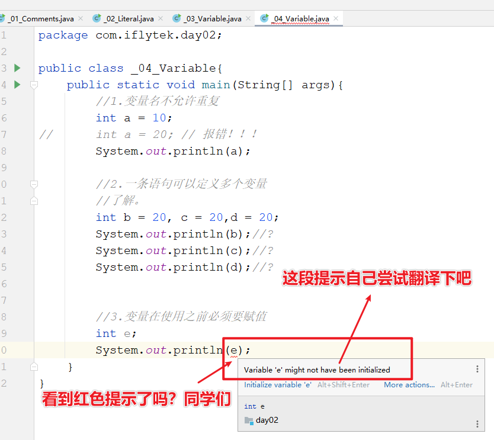
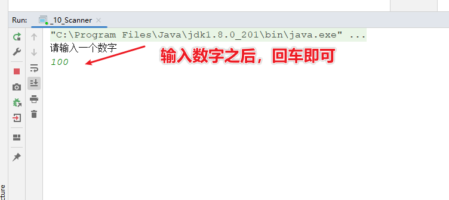
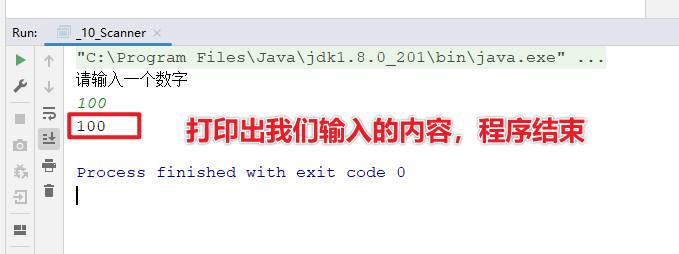

## 注释

​	注释是对代码的解释和说明文字。

Java中的注释分为三种：

* 单行注释：

~~~java
// 这是单行注释文字
~~~

* 多行注释：

~~~java
/*
这是多行注释文字
这是多行注释文字
这是多行注释文字
*/
注意：多行注释不能嵌套使用。
~~~

* 文档注释：

```java
/**
这是多行注释文字
这是多行注释文字
这是多行注释文字
*/
```

### 使用的技巧

​	如果我们要对代码进行解释，那么就可以使用注释。

​	当注释的内容比较少，一行就写完了，可以用单行注释。

​	如果注释的内容比较多，需要写在多行，那么可以使用多行注释。

### 注意点

​	注释的内容不会参与编译和运行的，仅仅是对代码的解释说明而已。

​	所以，不管在注释当中写什么内容，都不会影响代码运行的结果。


> **强调：**
>
> 一点要学会加注释！！！
>
> 处于初学阶段，尽量没一行代码，都是先写注释，再写代码！！！

### 示例

```java
package com.iflytek.day02;

/**
 * 描述：
 *  这是个文档注释
 *
 * @author 大勇哥
 * @version 1.0
 * @date 2022年10月3日20:21:13
 *
 */
public class _01_Comments {

    /*
    * 多行注释
    * 多行注释
    * 多行注释
    * */
    public static void main(String[] args) {
        // 单行注释
        System.out.println("Hello World");
        // System.out.println("这行代码被注释了，将不会被编译、运行！");
    }


    /**
     * 测试方法，文档注释
     */
    public void test(){
        System.out.println("test");
    }
}

```


## 关键字

### 概念

​	被Java赋予了特定含义的英文单词。

​	当我们在代码中写了关键字之后，程序在运行的时候，就知道要做什么事情了。

注意：关键字很多，不用刻意去记。

| **abstract**   | **assert**       | **boolean**   | **break**      | **byte**   |
| -------------- | ---------------- | ------------- | -------------- | ---------- |
| **case**       | **catch**        | **char**      | **class**      | **const**  |
| **continue**   | **default**      | **do**        | **double**     | **else**   |
| **enum**       | **extends**      | **final**     | **finally**    | **float**  |
| **for**        | **goto**         | **if**        | **implements** | **import** |
| **instanceof** | **int**          | **interface** | **long**       | **native** |
| **new**        | **package**      | **private**   | **protected**  | **public** |
| **return**     | **strictfp**     | **short**     | **static**     | **super**  |
| **switch**     | **synchronized** | **this**      | **throw**      | **throws** |
| **transient**  | **try**          | **void**      | **volatile**   | **while**  |

### 第一个关键字class

​	表示定义一个类。创建一个类。

类：Java项目最基本的组成单元，一个完整的Java项目有可能会有成千上万个类来组成的。

class后面跟随的就是这个类的名字，简称：类名。

在类名后面会有一对大括号，表示这个类的内容。

举例：

```java
public class HelloWorld{
    
   
}
```

解释：class表示定义类。

​	类名：HelloWorld

​	HelloWorld后面的大括号表示这个类的范围。

## 字面量

作用：告诉程序员，数据在程序中的书写格式。

| **字面量类型** | **说明**                                  | **程序中的写法**           |
| -------------- | ----------------------------------------- | -------------------------- |
| 整数           | 不带小数的数字                            | 666，-88                   |
| 小数           | 带小数的数字                              | 13.14，-5.21               |
| 字符           | 必须使用单引号，有且仅能一个字符          | ‘A’，‘0’，   ‘我’          |
| 字符串         | 必须使用双引号，内容可有可无              | “HelloWorld”，“黑马程序员” |
| 布尔值         | 布尔值，表示真假，只有两个值：true，false | true 、false               |
| 空值           | 一个特殊的值，空值                        | 值是：null                 |

~~~java
package com.iflytek.day02;

public class _02_Literal {
    public static void main(String[] args) {
        System.out.println(10); // 输出一个整数
        System.out.println(5.5); // 输出一个小数
        System.out.println('a'); // 输出一个字符
        System.out.println(true); // 输出boolean值true
        System.out.println("欢迎来到西亚斯学院"); // 输出字符串
    }
}
~~~

### 区分技巧

1. 不带小数点的数字都是整数类型的字面量。
2. 只要带了小数点，那么就是小数类型的字面量。
3. 只要用双引号引起来的，不管里面的内容是什么，不管里面有没有内容，都是字符串类型的字面量。
4. 字符类型的字面量必须用单引号引起来，不管内容是什么，但是个数有且只能有一个。
5. 字符类型的字面量只有两个值，true、false。
6. 空类型的字面量只有一个值，null。

## 变量

### 什么是变量？

​	变量就在程序中临时存储数据的容器。但是这个容器中只能存一个值。

### 变量的定义格式

```java
数据类型 变量名 = 数据值；
```


#### 格式详解

- ​	数据类型：限定了变量当中能存储什么类型的数据。
  - 如果要存10，那么数据类型就需要写整数类型。

  - 如果要存10.0，那么数据类型就需要写小数类型。

- ​	变量名：其实就是这个容器的名字。
  - 当以后想要使用变量里面的数据时，直接使用变量名就可以了。

- ​	数据值：真正存储在容器中的数据。


- ​	分号：表示语句的结束，就跟以前写作文时候的句号是一样的。


#### 常用的数据类型

​	整数：int

​	小数：（浮点数）double

​	其他数据类型稍后讲解

#### 案例：

```java
package com.iflytek.day02;

public class _03_Variable{
	public static void main(String[] args){
		//定义一个整数类型的变量
		//数据类型 变量名 = 数据值;
		int a = 16;
		System.out.println(a);//16
		
		//定义一个小数类型的变量
		double b = 10.1;
		System.out.println(b);//10.1
	}
}
```

#### 变量的注意事项

- 变量名不能重复
- 在一条语句中，可以定义多个变量。但是这种方式影响代码的阅读，所以了解一下即可。
- 变量在使用之前必须要赋值。

#### 案例：

```java
package com.iflytek.day02;

public class _04_Variable{
	public static void main(String[] args){
		//1.变量名不允许重复
		int a = 10;
//		int a = 20; // 报错！！！
		System.out.println(a);
		
		//2.一条语句可以定义多个变量
		//了解。
		int b = 20, c = 20,d = 20;
		System.out.println(b);//?
		System.out.println(c);//?
		System.out.println(d);//?

		
		//3.变量在使用之前必须要赋值
		int e;
//		System.out.println(e);
	}
}
```




### 变量的练习

#### 需求：

​	说出公交车到终点站之后，车上一共有多少乘客？

- 一开始没有乘客。
- 第一站：上去一位乘客，没有下来乘客。
- 第二站：上去两位乘客，下来一位乘客。
- 第三站：上去两位乘客，下来一位乘客。
- 第四站：没有上去乘客，下来一位乘客。
- 第五站：上去一位乘客，没有下来乘客。
- 问：到了终点站之后，车上一共多少乘客？


#### 	代码解析：

```java
package com.iflytek.day02;

public class _05_Variable_Pratice{
	//主入口
	public static void main(String[] args){
		//一开始没有乘客。
		int count = 0;
		//第一站：上去一位乘客
		//在原有的基础上 + 1
		count = count + 1;
		//System.out.println(count);
		//第二站：上去两位乘客，下来一位乘客
		count = count + 2 - 1; 
		//第三站：上去两位乘客，下来一位乘客
		count = count + 2 - 1;
		//第四站：下来一位乘客
		count = count - 1;
		//第五站：上去一位乘客
		count = count + 1;
		//请问：到了终点站，车上一共几位乘客。
		System.out.println(count);//3
	}
}
```


## 数据类型

### Java语言数据类型的分类

- 基本数据类型
- 引用数据类型（面向对象的时候再深入学习）

### 基本数据类型的四类八种

| 数据类型 | 关键字  | 内存占用 |                 取值范围                  |
| :------: | :-----: | :------: | :---------------------------------------: |
|   整数   |  byte   |    1     |    负的2的7次方 ~ 2的7次方-1(-128~127)    |
|          |  short  |    2     | 负的2的15次方 ~ 2的15次方-1(-32768~32767) |
|          |   int   |    4     |        负的2的31次方 ~ 2的31次方-1        |
|          |  long   |    8     |        负的2的63次方 ~ 2的63次方-1        |
|  浮点数  |  float  |    4     |        1.401298e-45 ~ 3.402823e+38        |
|          | double  |    8     |      4.9000000e-324 ~ 1.797693e+308       |
|   字符   |  char   |    2     |                  0-65535                  |
|   布尔   | boolean |    1     |                true，false                |

> **说明**
>
> ​	`e+38`表示是乘以10的38次方，同样，`e-45`表示乘以10的负45次方。
>
> ​	在java中整数默认是int类型，浮点数默认是double类型。


#### 需要记忆以下几点

byte类型的取值范围：-128 ~ 127

int类型的大概取值范围：	-21亿多  ~ 21亿多

整数类型和小数类型的取值范围大小关系：

​	`double > float > long > int > short > byte`

最为常用的数据类型选择：

- 在定义变量的时候，要根据实际的情况来选择不同类型的变量。

  比如：人的年龄，可以选择byte类型。

  比如：地球的年龄，可以选择long类型。

- 如果整数类型中，不太确定范围，那么默认使用int类型。

- 如果小数类型中，不太确定范围，那么默认使用double类型。

- 如果要定义字符类型的变量，那么使用char

- 如果要定义布尔类型的变量，那么使用boolean

### 定义8种基本数据类型变量

```java
public class _06_Variable{
    public static void main(String[] args){
        //1.定义byte类型的变量
        //数据类型 变量名 = 数据值;
        byte a = 10;
        System.out.println(a);

        //2.定义short类型的变量
        short b = 20;
        System.out.println(b);

        //3.定义int类型的变量
        int c = 30;
        System.out.println(c);

        //4.定义long类型的变量
        long d = 123456789123456789L;
        System.out.println(d);

        //5.定义float类型的变量
        float e = 10.1F;
        System.out.println(e);

        //6.定义double类型的变量
        double f = 20.3;
        System.out.println(f);

        //7.定义char类型的变量
        char g = 'a';
        System.out.println(g);

        //8.定义boolean类型的变量
        boolean h = true;
        System.out.println(h);

    }
}
```

#### **注意点**

- 如果要定义 一个整数类型的变量，不知道选择哪种数据类型了，默认使用int。
- 如果要定义 一个小数类型的变量，不知道选择哪种数据类型了，默认使用double。
- 如果要定义一个long类型的变量，那么在数据值的后面需要加上L后缀。（大小写都可以，建议大写。）
- 如果要定义一个float类型的变量，那么在数据值的后面需要加上F后缀。（大小写都可以）

### 练习1

#### **需求：**

​	定义5个变量记录老师的信息（姓名、年龄、性别、身高、婚姻状况）并打印

#### **代码示例：**

```java
public class _07_Variable_Pratice{
	public static void main(String[] args){
		//1.定义字符串类型的变量记录老师的姓名
		String name = "谢广坤";
		//2.定义整数类型的变量记录老师的年龄
		int age = 18;
		//3.定义字符类型的变量记录老师的性别
		char gender = '男';
		//4.定义小数类型的变量记录老师的身高
		double height = 180.1;
		//5.定义布尔类型的变量记录老师的婚姻状况
		boolean flag = true;
		
		//输出5个变量的值
		System.out.println(name);
		System.out.println(age);
		System.out.println(gender);
		System.out.println(height);
		System.out.println(flag);
		
	}
}
```

### 练习2

#### **需求：**

​	将（电影名称，主演，年份，评分）四个信息选择不同类型的变量，随后打印出来。

####  **代码示例：**

```java
public class _08_Variable_Pratice{
	public static void main(String[] args){
		//1.定义字符串变量记录电影的名称
		String movie = "送初恋回家";
		//2.定义三个变量记录主演的名字
		String name1 = "刘鑫";
		String name2 = "张雨提";
		String name3 = "高媛";
		//3. 定义整数类型的变量记录年龄的年份
		int year = 2020;
		//4.定义小数类型的变量记录电影的评分
		double score = 9.0;
		
		//打印变量的信息
		System.out.println(movie);
		System.out.println(name1);
		System.out.println(name2);
		System.out.println(name3);
		System.out.println(year);
		System.out.println(score);
		
	}
}
```

### 练习3

#### **需求：**

​	选择其中一部手机，将（手机价格，手机品牌）两个信息选择不同类型的变量，随后打印出来。 

####  **代码示例：**

```java
public class _09_Variable_Pratice{
	public static void main(String[] args){
		//1.定义小数类型的变量记录手机的价格
		double price = 5299.0;
		
		//2.定义字符串类型的变量记录手机的品牌
		String brand = "华为";
		
		//输出变量记录的值
		System.out.println(price);
		System.out.println(brand);
	}
}
```


## 标识符

业内大多数程序员都在遵守阿里巴巴的命名规则。

### 硬性要求：

​	必须要这么做，否则代码会报错。

- 必须由`数字、字母、下划线_、美元符号$`组成。
- 数字不能开头
- 不能是关键字 class 
- 区分大小写的。

### 软件建议：

​	如果不这么做，代码不会报错，但是会让代码显得比较low。

#### 小驼峰命名法

适用于变量名和方法名

* 如果是一个单词，那么全部小写，比如：name

* 如果是多个单词，那么从第二个单词开始，首字母大写，比如：firstName、maxAge

#### 大驼峰命名法

适用于`类名`

* 如果是一个单词，那么首字母大写。比如：Demo、Test。

* 如果是多个单词，那么每一个单词首字母都需要大写。比如：HelloWorld

不管起什么名字，都要做到见名知意。

### 阿里巴巴命名规范细节：

1. 尽量不要用拼音。但是一些国际通用的拼音可视为英文单词。

   正确：alibaba、hangzhou、nanjing

   错误：jiage、dazhe

2. 平时在给变量名、方法名、类名起名字的时候，不要使用下划线或美元符号。

   错误：_name

   正确：name

## 键盘录入

​	键盘录入的实际功能Java已经帮我们写好了，不需要我们自己再实现了，而Java写好的功能都放在了Scanner这个类中，所以，我们只要直接使用Scanner这个类就可以了。

### 使用步骤：

- 第一步：

  ​	导包：其实就是表示先找到Scanner这个类在哪。

- 第二步：

  ​	创建对象：其实就表示申明一下，我准备开始用Scanner这个类了。

- 第三步：

  ​	接收数据：也是真正干活的代码。

### 代码示例：

```java
package com.iflytek.day02;

import java.util.Scanner;//导包，其实就是先找到Scanner这个类在哪

public class _10_Scanner{
	public static void main(String[] args){
		//2.创建对象，其实就是申明一下，我准备开始用Scanner这个类了。
		Scanner sc = new Scanner(System.in);
		//3.接收数据
		//当程序运行之后，我们在键盘输入的数据就会被变量i给接收了
		System.out.println("请输入一个数字");
		int i = sc.nextInt();
		System.out.println(i);
	}
}
```





