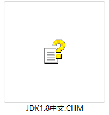
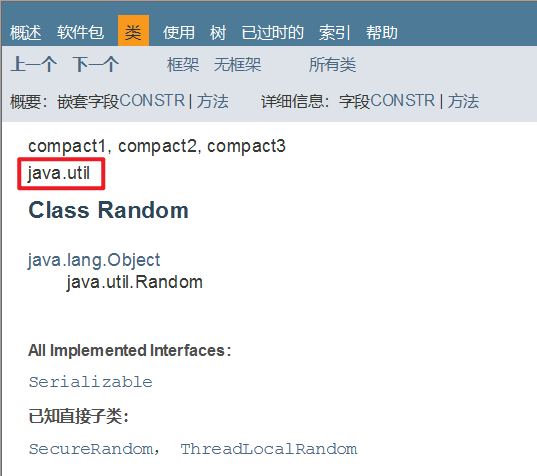
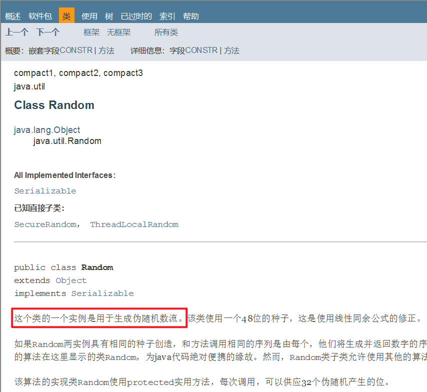
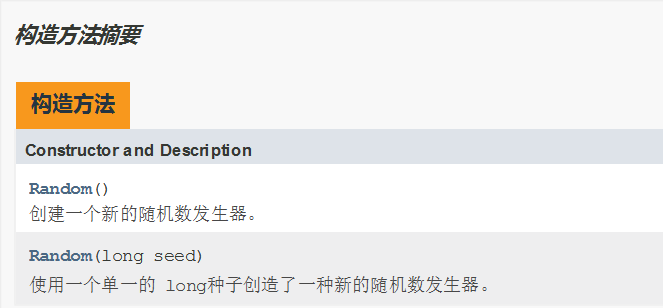
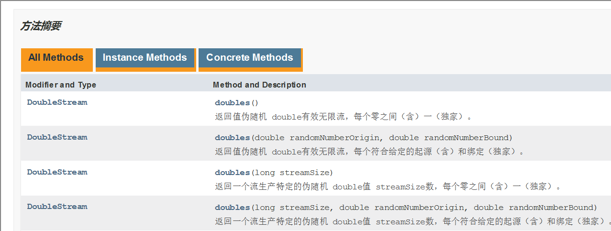

# 1.API

## 1.1API概述

- 什么是API

  ​	API (Application Programming Interface) ：应用程序编程接口

- java中的API

  ​	指的就是 JDK 中提供的各种功能的 Java类，这些类将底层的实现封装了起来，我们不需要关心这些类是如何实现的，只需要学习这些类如何使用即可，我们可以通过帮助文档来学习这些API如何使用。

## 1.2如何使用API帮助文档

- 打开帮助文档



- 找到索引选项卡中的输入框


- 在输入框中输入Random


- 看类在哪个包下



- 看类的描述



- 看构造方法



- 看成员方法



# 2.String类

## 2.1String类概述

​	String 类代表字符串，Java 程序中的所有字符串文字（例如“abc”）都被实现为此类的实例。也就是说，Java 程序中所有的双引号字符串，都是 String 类的对象。String 类在 java.lang 包下，所以使用的时候不需要导包！

## 2.2String类的特点

- 字符串不可变，它们的值在创建后不能被更改
- 虽然 String 的值是不可变的，但是它们可以被共享
- 字符串效果上相当于字符数组( char[] )，但是底层原理是字节数组( byte[] )

## 2.3String类的构造方法

### 常用的构造方法

| 方法名                      | 说明                                      |
| --------------------------- | ----------------------------------------- |
| public   String()           | 创建一个空白字符串对象，不含有任何内容    |
| public   String(char[] chs) | 根据字符数组的内容，来创建字符串对象      |
| public   String(byte[] bys) | 根据字节数组的内容，来创建字符串对象      |
| String s =   “abc”;         | 直接赋值的方式创建字符串对象，内容就是abc |

### 示例代码

```java
public class _01_StringDemo {
    public static void main(String[] args) {
        //public String()：创建一个空白字符串对象，不含有任何内容
        String s1 = new String();
        System.out.println("s1:" + s1);

        //public String(char[] chs)：根据字符数组的内容，来创建字符串对象
        char[] chs = {'a', 'b', 'c'};
        String s2 = new String(chs);
        System.out.println("s2:" + s2);

        //public String(byte[] bys)：根据字节数组的内容，来创建字符串对象
        byte[] bys = {97, 98, 99};
        String s3 = new String(bys);
        System.out.println("s3:" + s3);

        //String s = “abc”;	直接赋值的方式创建字符串对象，内容就是abc
        String s4 = "abc";
        System.out.println("s4:" + s4);
    }
}
```

## 2.4 创建字符串对象两种方式的区别

- 通过构造方法创建

  ​	通过 new 创建的字符串对象，每一次 new 都会申请一个内存空间，虽然内容相同，但是地址值不同

- 直接赋值方式创建

  ​	以“”方式给出的字符串，只要字符序列相同(顺序和大小写)，无论在程序代码中出现几次，JVM 都只会建立一个 String 对象，并在字符串池中维护

## 2.5 字符串的比较

### 2.5.1==号的作用

- 比较基本数据类型：比较的是具体的值
- 比较引用数据类型：比较的是对象地址值

### 2.5.2equals方法的作用

#### 方法介绍

```java
public boolean equals(String s)     比较两个字符串内容是否相同、区分大小写
```

#### 示例代码

```java
public class _02_StringDemo {
    public static void main(String[] args) {
        //构造方法的方式得到对象
        char[] chs = {'a', 'b', 'c'};
        String s1 = new String(chs);
        String s2 = new String(chs);

        //直接赋值的方式得到对象
        String s3 = "abc";
        String s4 = "abc";

        //比较字符串对象地址是否相同
        System.out.println(s1 == s2);
        System.out.println(s1 == s3);
        System.out.println(s3 == s4);
        System.out.println("--------");

        //比较字符串内容是否相同
        System.out.println(s1.equals(s2));
        System.out.println(s1.equals(s3));
        System.out.println(s3.equals(s4));
    }
}
```

## 2.6 用户登录案例

### 2.6.1 案例需求

​	已知用户名和密码，请用程序实现模拟用户登录。总共给三次机会，登录之后，给出相应的提示

### 2.6.2 代码实现

```java
public class _03_LoginDemo {
    public static void main(String[] args) {
        //1.定义两个变量用来记录正确的用户名和密码
        String rightUsername = "zhangsan";
        String rightPassword = "123456";

        //2.键盘录入用户名和密码
        //ctrl + alt + T 选择包裹方式

        for (int i = 0; i < 3; i++) {//0 1 2
            Scanner sc = new Scanner(System.in);
            System.out.println("请输入用户名");
            String username = sc.next();
            System.out.println("请输入密码");
            String password = sc.next();

            //3.判断比较
            if (username.equals(rightUsername) && password.equals(rightPassword)) {
                System.out.println("登录成功");
                //如果正确，循环结束
                break;
            } else {
                //最后一次机会
                if(i == 2){
                    System.out.println("账户" + username + "被锁定，请联系管理员");
                }else{
                    //不是最后一次机会
                    System.out.println("用户名或密码错误，登录失败,还剩下" + (2 - i) + "次机会");//2 1 0
                }
            }
        }

    }
}

```

## 2.7 遍历字符串案例

### 2.7.1案例需求

​	键盘录入一个字符串，使用程序实现在控制台遍历该字符串

### 2.7.2直接遍历字符串

```java
package com.iflytek.day12;

import java.util.Scanner;

public class _04_StringForeach {
    public static void main(String[] args) {
        //两个方法：
        //charAt()：会根据索引获取对应的字符
        //length(): 会返回字符串的长度

        //1.键盘录入一个字符串
        Scanner sc = new Scanner(System.in);
        System.out.println("请输入字符串");
        String str = sc.next();
        System.out.println(str);

        //2.遍历
        for (int i = 0; i < str.length(); i++) {
            //i 依次表示字符串的每一个索引
            //索引的范围：0 ~  长度-1
            //根据索引获取字符串里面的每一个字符
            //ctrl + alt + V 自动生成左边的接受变量
            char c = str.charAt(i);
            System.out.println(c);
        }
    }
}

```

## 2.8 统计字符次数案例

### 2.8.1 案例需求

​	键盘录入一个字符串，统计该字符串中大写字母字符，小写字母字符，数字字符出现的次数(不考虑其他字符)

### 2.8.2 代码实现

```java
package com.iflytek.day12;

import java.util.Scanner;

public class _05_StringCount {
    public static void main(String[] args) {
        //键盘录入一个字符串，统计大写，小写，数字出现的次数

        //1.键盘录入一个字符串
        Scanner sc = new Scanner(System.in);
        System.out.println("请输入一个字符串");
        String str = sc.next();

        //2.统计 --- 计数器count
        //此时我要统计的有3样东西，所以要定义3个计数器分别进行统计
        int bigCount = 0;
        int smallCount = 0;
        int numberCount = 0;
        //得到这个字符串里面每一个字符
        for (int i = 0; i < str.length(); i++) {
            //i 表示字符串中的索引
            //c 表示字符串中的每一个字符
            char c = str.charAt(i);

            //对c进行判断
            if (c >= 'a' && c <= 'z') {
                smallCount++;
            }else if(c >= 'A' && c <= 'Z'){
                bigCount++;
            }else if(c >= '0' && c <= '9'){
                numberCount++;
            }
        }

        //3.当循环结束之后，三个变量记录的就是对应的个数
        System.out.println("大写字符有:" + bigCount + "个");
        System.out.println("小写字符有:" + smallCount + "个");
        System.out.println("数字字符有:" + numberCount + "个");
    }
}

```

## 2.9 字符串拼接案例

### 2.9.1 案例需求

​	定义一个方法，把 int 数组中的数据按照指定的格式拼接成一个字符串返回，调用该方法，

​	并在控制台输出结果。例如，数组为 int[] arr = {1,2,3}; ，执行方法后的输出结果为：[1, 2, 3]

### 2.9.2 代码实现

```java
package com.iflytek.day12;

public class _06_StringConcat {
    public static void main(String[] args) {
        int[] arr = {1, 2, 3, 4, 5};
        String str = arrToString(arr);
        System.out.println(str);
    }

    //作用：把一个数组变成字符串
    public static String arrToString(int[] arr) {
        String s = "";
        s = s + "[";
        for (int i = 0; i < arr.length; i++) {
           if(i == arr.length - 1){
               s = s + arr[i];
           }else{
               s = s + arr[i] + ", ";
           }
        }
        s = s + "]";

        return s;
    }

}


```

## 2.10 字符串反转案例

### 2.10.1案例需求

​	定义一个方法，实现字符串反转。键盘录入一个字符串，调用该方法后，在控制台输出结果

​	例如，键盘录入 abc，输出结果 cba

### 2.10.2代码实现

```java
package com.iflytek.day12;

import java.util.Scanner;

public class _07_StringReverse {
    public static void main(String[] args) {
        /*定义一个方法，实现字符串反转。键盘录入一个字符串，调用该方法后，在控制台输出结果
        例如，键盘录入 abc，输出结果 cba*/
        //1.定义一个字符串
        Scanner sc = new Scanner(System.in);
        System.out.println("请输入一个字符串");
        String str = sc.next();
        //2.定义一个方法，反转字符串
        //abc  --->  cba
        //可以把字符串倒着遍历，再拼接
        String result = reverse(str);
        System.out.println(result);
    }

    //注释：方法的作用就是反转字符串
    //把传递进来的字符串进行反转
    public static String reverse(String str){//abc
        //核心思想：倒着遍历并进行拼接就可以了
        //fori :正着遍历  forr：倒着遍历
        String s = "";
        for (int i = str.length() - 1; i >= 0; i--) {
            //i 依次表示字符串里面的每一个索引（倒着的）
            //我们就可以拿到里面的每一个字符并拼接
            s = s + str.charAt(i);
        }

        //把倒着拼接之后的结果返回即可
        return s;
    }
}

```

## 2.11 金额转换

### 2.11.1 案例需求

​	把2135变成：零佰零拾零万贰仟壹佰叁拾伍元 

​	把789变成：零佰零拾零万零仟柒佰捌拾玖元

### 2.11.2 代码实现

```java
package com.iflytek.day12;

import java.util.Scanner;

public class _08_MoneyToUpper {
    public static void main(String[] args) {
        //1.键盘录入一个金额
        Scanner sc = new Scanner(System.in);
        int money;
        while (true) {
            System.out.println("请录入一个金额");
            money = sc.nextInt();
            if (money >= 0 && money <= 9999999) {
                break;
            } else {
                System.out.println("金额无效");
            }
        }

        //定义一个变量用来表示钱的大写
        String moneyStr = "";

        //2.得到money里面的每一位数字,再转成中文
        while (true) {//2135
            //从右往左获取数据，因为右侧是数据的个位
            int ge = money % 10;
            String capitalNumber = getCapitalNumber(ge);
            //把转换之后的大写拼接到moneyStr当中
            moneyStr = capitalNumber + moneyStr;
            //第一次循环 ： "伍" + "" = "伍"
            //第二次循环 ： "叁" + "伍" = "叁伍"
            //去掉刚刚获取的数据
            money = money / 10;

            //如果数字上的每一位全部获取到了，那么money记录的就是0，此时循环结束
            if (money == 0) {
                break;
            }
        }

        //3.在前面补0，补齐7位
        int count = 7 - moneyStr.length();
        for (int i = 0; i < count; i++) {
            moneyStr = "零" + moneyStr;
        }
        System.out.println(moneyStr);//零零零贰壹叁伍

        //4.插入单位
        //定义一个数组表示单位
        String[] arr = {"佰","拾","万","仟","佰","拾","元"};
        //               零    零   零   贰   壹   叁   伍

        //遍历moneyStr，依次得到 零    零   零   贰   壹   叁   伍
        //然后把arr的单位插入进去

        String result = "";
        for (int i = 0; i < moneyStr.length(); i++) {
            char c = moneyStr.charAt(i);
            //把大写数字和单位拼接到result当中
            result = result + c + arr[i];
        }

        //5.打印最终结果
        System.out.println(result);

    }


    //定义一个方法把数字变成大写的中文
    //1 -- 壹
    public static String getCapitalNumber(int number) {
        //定义数组，让数字跟大写的中文产生一个对应关系
        String[] arr = {"零", "壹", "贰", "叁", "肆", "伍", "陆", "柒", "捌", "玖"};
        //返回结果
        return arr[number];
    }

}

```

## 2.12 手机号屏蔽

### 需求：

以字符串的形式从键盘接受一个手机号，将中间四位号码屏蔽

最终效果为：`131****9468`

### 代码实现：

```java
package com.iflytek.day12;

import java.util.Scanner;

public class _09_MobileEncode {
    public static void main(String[] args) {
        /*以字符串的形式从键盘接受一个手机号，将中间四位号码屏蔽
        最终效果为：131****9468*/
        //1.键盘录入一个手机号码
        Scanner sc = new Scanner(System.in);
        System.out.println("请输入手机号码");
        String phoneNumber = sc.next();//13112349408

        //2.截取手机号码中的前三位
        String star = phoneNumber.substring(0, 3);

        //3.截取手机号码中的最后四位
        //此时我用substring方法，是用1个参数的，还是两个参数的？1个参数的会更好
        //因为现在我要截取到最后，所以建议使用1个参数的。
        String end = phoneNumber.substring(7);

        //4.拼接
        String result = star + "****" + end;

        System.out.println(result);

    }
}

```

## 2.13 敏感词替换 

### 需求1：

键盘录入一个 字符串，如果字符串中包含（TMD），则使用***替换 

### 示例代码：

```java
package com.iflytek.day12;

public class _10_SensitiveReplace {
    public static void main(String[] args) {
        //1.定义一个变量表示骂人的话
        String talk = "后裔你玩什么啊，TMD";

        //2.把这句话中的敏感词进行替换
        String result = talk.replace("TMD", "***");

        //3.打印
        System.out.println(talk);
        System.out.println(result);
    }
}

```

### 需求2：

如果要替换的敏感词比较多怎么办？

### 示例代码：

```java
package com.iflytek.day12;

import java.util.Scanner;

public class _11_SensitiveReplace {
    public static void main(String[] args) {
        //实际开发中，敏感词会有很多很多

        //1.先键盘录入要说的话
        Scanner sc = new Scanner(System.in);
        System.out.println("请输入要说的话");
        String talk = sc.next();//后裔你玩什么啊，TMD,GDX,ctmd,ZZ

        //2.定义一个数组用来存多个敏感词
        String[] arr = {"TMD","GDX","ctmd","ZZ","lj","FW","nt"};

        //3.把说的话中所有的敏感词都替换为***

        for (int i = 0; i < arr.length; i++) {
            //i 索引
            //arr[i] 元素 --- 敏感词
            talk = talk.replace(arr[i],"***");
        }

        //4.打印结果
        System.out.println(talk);//后裔你玩什么啊，***,***,***,***

    }
}

```

## 2.14 身份证信息查看

### 需求：

​	身份证号的每一位都是有固定的含义：

* 1、2位：省份 
* 3、4位：城市 
* 5、6位：区县 
* 7-14位：出生年、月、日 
* 15、16位：所在地派出所 
* 17位：性别（奇数男性，偶数女性）
* 18位：个人信息码（随机产生） 

要求打印内容方式如下：

​	人物信息为：

​	出生年月日：XXXX年X月X日

​	性别为：男/女

### 示例代码：

```java
package com.iflytek.day12;

public class _12_IdCard {
    public static void main(String[] args) {
        //1.定义一个字符串记录身份证号码
        String id = "321281202001011234";

        //2.获取出生年月日
        String year = id.substring(6, 10);
        String month = id.substring(10, 12);
        String day = id.substring(12, 14);


        System.out.println("人物信息为：");
        System.out.println("出生年月日:" + year + "年" + month + "月" + day + "日");

        //3.获取性别
        char gender = id.charAt(16);//'3'  ---> 3
        //利用ASCII码表进行转换
        //'0' --->  48
        //'1' --->  49
        //'2' --->  50
        //'3' --->  51
        //'4' --->  52
        //'5' --->  53
        //'6' --->  54
        //'7' --->  55
        //'8' --->  56
        //'9' --->  57

       int num = gender - 48;
        if(num % 2 == 0){
            System.out.println("性别为:女");
        }else{
            System.out.println("性别为:男");
        }
    }
}
```

# 3.StringBuilder

StringBuilder 可以看成是一个容器，创建之后里面的内容是`可变`的。

当我们在拼接字符串和反转字符串的时候会使用到

## 3.1 基本使用

```java
package com.iflytek.day12;

public class _13_StringBuilderDemo {
    public static void main(String[] args) {
        //1.创建对象
        StringBuilder sb = new StringBuilder("abc");

        //2.添加元素
        /*sb.append(1);
        sb.append(2.3);
        sb.append(true);*/

        //反转
        sb.reverse();

        //获取长度
        int len = sb.length();
        System.out.println(len);


        //打印
        //普及：
        //因为StringBuilder是Java已经写好的类
        //java在底层对他做了一些特殊处理。
        //打印对象不是地址值而是属性值。
        System.out.println(sb);
    }
}
```

## 3.2 链式编程

```java
package com.iflytek.day12;

public class _14_StringBuilderDemo {
    public static void main(String[] args) {
        //1.创建对象
        StringBuilder sb = new StringBuilder();

        //2.添加字符串
        sb.append("aaa").append("bbb").append("ccc").append("ddd");

        System.out.println(sb);//aaabbbcccddd

        //3.再把StringBuilder变回字符串
        String str = sb.toString();
        System.out.println(str);//aaabbbcccddd

    }
}
```

## 3.3 练习1：对称字符串 

### 需求：

​	键盘接收一个字符串，程序判断出该字符串是否是对称字符串，并在控制台打印是或不是

  	对称字符串：123321、111

  	非对称字符串：123123

### 代码示例：

```java
package com.iflytek.day12;

import java.util.Scanner;

public class _15_SymmetricString {
    //使用StringBuilder的场景：
    //1.字符串的拼接
    //2.字符串的反转

    public static void main(String[] args) {
        //1.键盘录入一个字符串
        Scanner sc = new Scanner(System.in);
        System.out.println("请输入一个字符串");
        String str = sc.next();

        //2.反转键盘录入的字符串
        String result = new StringBuilder().append(str).reverse().toString();

        //3.比较
        if(str.equals(result)){
            System.out.println("当前字符串是对称字符串");
        }else{
            System.out.println("当前字符串不是对称字符串");
        }

    }
}

```


## 3.4 练习2：拼接字符串 

### 需求：

定义一个方法，把 int 数组中的数据按照指定的格式拼接成一个字符串返回。

​          调用该方法，并在控制台输出结果。

​          例如：数组为int[] arr = {1,2,3}; 

​          执行方法后的输出结果为：[1, 2, 3]

### 代码示例:

```java
package com.iflytek.day12;

public class _16_ConcatString {
    public static void main(String[] args) {
        //1.定义数组
        int[] arr = {1,2,3};
        //2.调用方法把数组变成字符串
        String str = arrToString(arr);
        System.out.println(str);
    }

    public static String arrToString(int[] arr){
        StringBuilder sb = new StringBuilder();
        sb.append("[");

        for (int i = 0; i < arr.length; i++) {
            if(i == arr.length - 1){
                sb.append(arr[i]);
            }else{
                sb.append(arr[i]).append(", ");
            }
        }
        sb.append("]");
        return sb.toString();
    }
}

```


# 关于字符串的小扩展：

1. 字符串存储的内存原理

   String s = “abc”；直接赋值

   特点：

   ​	此时字符串abc是存在字符串常量池中的。

   ​	先检查字符串常量池中有没有字符串abc，如果有，不会创建新的，而是直接复用。如果没有abc，才会创建一个新的。

   所以，直接赋值的方式，代码简单，而且节约内存。

2. new出来的字符串

   看到new关键字，一定是在堆里面开辟了一个小空间。

   String s1 = new String（“abc”）；

   String s2 = “abc”；

   s1记录的是new出来的，在堆里面的地址值。

   s2是直接赋值的，所以记录的是字符串常量池中的地址值。

3. ==号比较的到底是什么？

   如果比较的是基本数据类型：比的是具体的数值是否相等。

   如果比较的是引用数据类型：比的是地址值是否相等。

   结论：==只能用于比较基本数据类型。不能比较引用数据类型。


