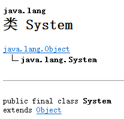
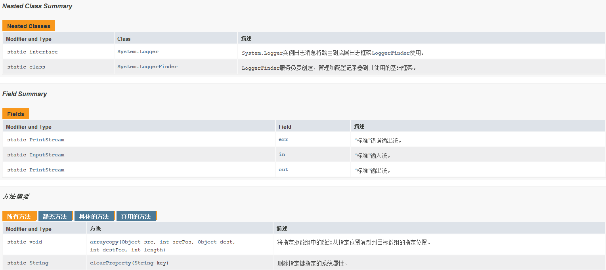
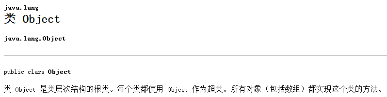
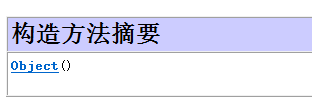
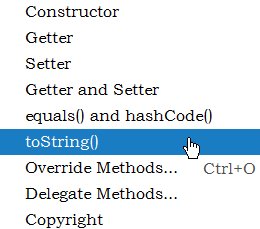
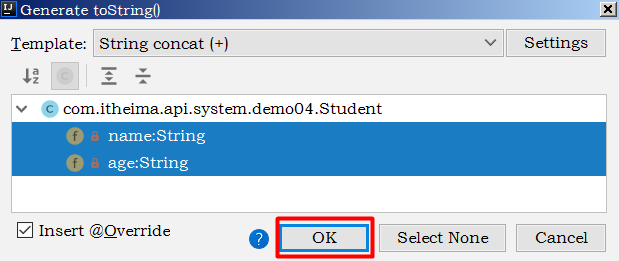
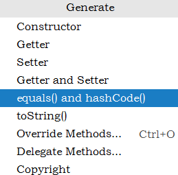
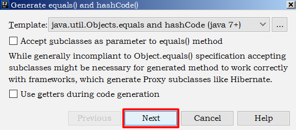
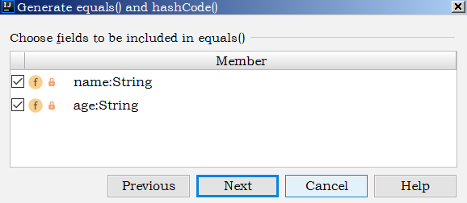
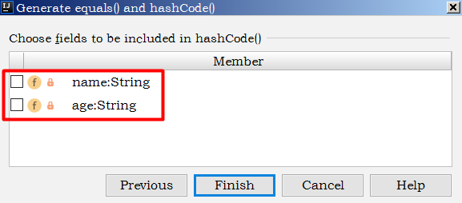

# 1 Math类

## 1.1 概述

> tips：了解内容

查看API文档，我们可以看到API文档中关于Math类的定义如下：

  

Math类所在包为java.lang包，因此在使用的时候不需要进行导包。并且Math类被final修饰了，因此该类是不能被继承的。

Math类包含执行基本数字运算的方法，我们可以使用Math类完成基本的数学运算。


要想使用Math类我们就需要先创建该类的对象，那么创建对象就需要借助于构造方法。因此我们就需要首先查看一下API文档，看看API文档中针对Math类有没有提供对应的构造方法。通过API文档来查看

一下Math类的成员，如下所示：

 

在API文档中没有体现可用的构造方法，因此我们就不能直接通过new关键字去创建Math类的对象。同时我们发现Math类中的方法都是静态的，因此在使用的时候我们可以直接通过类名去调用。在Math类中定义了很多数学运算的方法，但是我们并不可能将所有的方法学习一遍，我们主要学习的就是一些常见的方法。

## 1.2 常见方法

### 常见方法介绍

我们要学习的Math的常见方法如下所示：

```java
public static int abs(int a)					// 返回参数的绝对值
public static double ceil(double a)				// 返回大于或等于参数的最小整数
public static double floor(double a)			// 返回小于或等于参数的最大整数
public static int round(float a)				// 按照四舍五入返回最接近参数的int类型的值
public static int max(int a,int b)				// 获取两个int值中的较大值
public static int min(int a,int b)				// 获取两个int值中的较小值
public static double pow (double a,double b)	// 计算a的b次幂的值
public static double random()					// 返回一个[0.0,1.0)的随机值
```

### 案例演示

接下来我们就来演示一些这些方法的执行效果，如下所示：

```java
public class MathDemo01 {

    public static void main(String[] args) {

        // public static int abs(int a)         返回参数的绝对值
        System.out.println("-2的绝对值为：" + Math.abs(-2));
        System.out.println("2的绝对值为：" + Math.abs(2));

        // public static double ceil(double a)  返回大于或等于参数的最小整数
        System.out.println("大于或等于23.45的最小整数位：" + Math.ceil(23.45));
        System.out.println("大于或等于-23.45的最小整数位：" + Math.ceil(-23.45));

        // public static double floor(double a) 返回小于或等于参数的最大整数
        System.out.println("小于或等于23.45的最大整数位：" + Math.floor(23.45));
        System.out.println("小于或等于-23.45的最大整数位：" + Math.floor(-23.45));

        // public static int round(float a)     按照四舍五入返回最接近参数的int
        System.out.println("23.45四舍五入的结果为：" + Math.round(23.45));
        System.out.println("23.55四舍五入的结果为：" + Math.round(23.55));

        // public static int max(int a,int b)   返回两个int值中的较大值
        System.out.println("23和45的最大值为: " + Math.max(23, 45));

        // public static int min(int a,int b)   返回两个int值中的较小值
        System.out.println("12和34的最小值为: " + Math.min(12 , 34));

        // public static double pow (double a,double b)返回a的b次幂的值
        System.out.println("2的3次幂计算结果为: " + Math.pow(2,3));

        // public static double random()返回值为double的正值，[0.0,1.0)
        System.out.println("获取到的0-1之间的随机数为: " + Math.random());
    }

}
```

运行程序进行测试，控制台输出结果如下：

```java
-2的绝对值为：2
2的绝对值为：2
大于或等于23.45的最小整数位：24.0
大于或等于-23.45的最小整数位：-23.0
小于或等于23.45的最大整数位：23.0
小于或等于-23.45的最大整数位：-24.0
23.45四舍五入的结果为：23
23.55四舍五入的结果为：24
23和45的最大值为: 45
12和34的最小值为: 12
2的3次幂计算结果为: 8.0
获取到的0-1之间的随机数为: 0.7322484131745958
```

## 1.3 算法小题(质数)

### 需求：

​	判断一个数是否为一个质数

### 代码实现：

```java
public class MathDemo2 {
    public static void main(String[] args) {
        //判断一个数是否为一个质数
        System.out.println(isPrime(997));
        //997 2~996 995次
    }

    public static boolean isPrime(int number) {
        int count = 0;
        for (int i = 2; i <= Math.sqrt(number); i++) {
            count++;
            if (number % i == 0) {
                return false;
            }
        }
        System.out.println(count);
        return true;
    }
}
```

## 1.4 算法小题(自幂数)

自幂数，一个n位自然数等于自身各个数位上数字的n次幂之和

​	举例1：三位数  1^3 + 5^3 + 3^3 = 153  

​	举例2：四位数  1^4 + 6^4 + 3^4 + 4^4 = 1634

如果自幂数是：

* 一位自幂数，也叫做：独身数
* 三位自幂数：水仙花数  四位自幂数：四叶玫瑰数
* 五位自幂数：五角星数  六位自幂数：六合数
* 七位自幂数：北斗七星数  八位自幂数：八仙数
* 九位自幂数：九九重阳数  十位自幂数：十全十美数

统计一共有多少个水仙花数。

```java
package com.iflytek.day16;

public class MathDemo03 {
    public static void main(String[] args) {
        //水仙花数:100 ~ 999
        int count = 0;
        //得到每一个三位数
        for (int i = 100; i <= 999; i++) {
            //个位 十位 百位
            int ge = i % 10;
            int shi = i / 10 % 10;
            int bai = i / 100 % 10;
            //判断:
            //每一位的三次方之和 跟本身 进行比较。
            double sum = Math.pow(ge, 3) + Math.pow(shi, 3) + Math.pow(bai, 3);
            if (sum == i) {
                count++;
                System.out.println(i);
            }
        }
    }

}
```


# 2 System类

## 2.1 概述

查看API文档，我们可以看到API文档中关于System类的定义如下：

  


System类所在包为java.lang包，因此在使用的时候不需要进行导包。并且System类被final修饰了，因此该类是不能被继承的。

System包含了系统操作的一些常用的方法。比如获取当前时间所对应的毫秒值，再比如终止当前JVM等等。


要想使用System类我们就需要先创建该类的对象，那么创建对象就需要借助于构造方法。因此我们就需要首先查看一下API文档，看看API文档中针对System类有没有提供对应的构造方法。通过API文档来

查看一下System类的成员，如下所示：

 

在API文档中没有体现可用的构造方法，因此我们就不能直接通过new关键字去创建System类的对象。同时我们发现System类中的方法都是静态的，因此在使用的时候我们可以直接通过类名去调用（Nested Class Summary内部类或者内部接口的描述）。

## 2.2 常见方法

<font color="red" size="3">**常见方法介绍**</font>

我们要学习的System类中的常见方法如下所示：

```java
public static long currentTimeMillis()			// 获取当前时间所对应的毫秒值（当前时间为0时区所对应的时间即就是英国格林尼治天文台旧址所在位置）
public static void exit(int status)				// 终止当前正在运行的Java虚拟机，0表示正常退出，非零表示异常退出
public static native void arraycopy(Object src,  int  srcPos, Object dest, int destPos, int length); // 进行数值元素copy
```

### 案例演示

接下来我们就来通过一些案例演示一下这些方法的特点。

<font color="blue" size="2">**案例1**</font>：演示currentTimeMillis方法

```java
public class SystemDemo01 {

    public static void main(String[] args) {

        // 获取当前时间所对应的毫秒值
        long millis = System.currentTimeMillis();

        // 输出结果
        System.out.println("当前时间所对应的毫秒值为：" + millis);

    }

}
```

运行程序进行测试，控制台的输出结果如下：

```java
当前时间所对应的毫秒值为：1576050298343
```

获取到当前时间的毫秒值的意义：我们常常来需要统计某一段代码的执行时间。此时我们就可以在执行这段代码之前获取一次时间，在执行完毕以后再次获取一次系统时间，然后计算两个时间的差值，

这个差值就是这段代码执行完毕以后所需要的时间。如下代码所示：

```java
public class SystemDemo02 {
    public static void main(String[] args) {
        //判断1~100000之间有多少个质数

        long start = System.currentTimeMillis();

        for (int i = 1; i <= 100000; i++) {
            boolean flag = isPrime2(i);
            if (flag) {
                System.out.println(i);
            }
        }
        long end = System.currentTimeMillis();
        //获取程序运行的总时间
        System.out.println(end - start); //方式一：1514 毫秒  方式二：71毫秒
    }

    //以前判断是否为质数的方式
    public static boolean isPrime1(int number) {
        for (int i = 2; i < number; i++) {
            if (number % i == 0) {
                return false;
            }
        }
        return true;
    }

    //改进之后判断是否为质数的方式（效率高）
    public static boolean isPrime2(int number) {
        for (int i = 2; i <= Math.sqrt(number); i++) {
            if (number % i == 0) {
                return false;
            }
        }
        return true;
    }
}
```

<font color="blue" size="2">**案例2**</font>：演示exit方法

```java
public class SystemDemo03 {

    public static void main(String[] args) {
        
        // 输出
        System.out.println("程序开始执行了.....");
        
        // 终止JVM
        System.exit(0);
        
        // 输出
        System.out.println("程序终止了..........");
        
    }
    
}
```

运行程序进行测试，控制台输出结果如下：

```java
程序开始执行了.....
```

此时可以看到在控制台只输出了"程序开始了..."，由于JVM终止了，因此输出"程序终止了..."这段代码没有被执行。

<font color="blue" size="2">**案例3**</font>：演示arraycopy方法

方法参数说明：

```java
// src: 	 源数组
// srcPos：  源数值的开始位置
// dest：    目标数组
// destPos： 目标数组开始位置
// length:   要复制的元素个数
public static native void arraycopy(Object src,  int  srcPos, Object dest, int destPos, int length); 
```

代码如下所示：

```java
public class SystemDemo04 {

    public static void main(String[] args) {

        // 定义源数组
        int[] srcArray = {23 , 45 , 67 , 89 , 14 , 56 } ;

        // 定义目标数组
        int[] desArray = new int[10] ;

        // 进行数组元素的copy: 把srcArray数组中从0索引开始的3个元素，从desArray数组中的1索引开始复制过去
        System.arraycopy(srcArray , 0 , desArray , 1 , 3);

        // 遍历目标数组
        for(int x = 0 ; x < desArray.length ; x++) {
            if(x != desArray.length - 1) {
                System.out.print(desArray[x] + ", ");
            }else {
                System.out.println(desArray[x]);
            }

        }

    }

}
```

运行程序进行测试，控制台输出结果如下所示：

```java
0, 23, 45, 67, 0, 0, 0, 0, 0, 0
```

通过控制台输出结果我们可以看到，数组元素的确进行复制了。

使用这个方法我们也可以完成数组元素的删除操作，如下所示：

```java
public class SystemDemo05 {
    public static void main(String[] args) {
        // 定义一个数组
        int[] srcArray = {23 , 45 , 67 , 89 , 14 , 56 } ;
        // 删除数组中第3个元素(67)：要删除67这个元素，我们只需要将67后面的其他元素依次向前进行移动即可
        System.arraycopy(srcArray , 3 , srcArray , 2 , 3);
        // 遍历srcArray数组
        for(int x = 0 ; x < srcArray.length ; x++) {
            if(x != desArray.length - 1) {
                System.out.print(srcArray[x] + ", ");
            }else {
                System.out.println(srcArray[x]);
            }
        }
    }
}
```

运行程序进行测试，控制台的输出结果如下所示：

```java
23, 45, 89, 14, 56, 56 
```

通过控制台输出结果我们可以看到此时多出了一个56元素，此时我们只需要将最后一个位置设置为0即可。如下所示：

```java
public class SystemDemo06 {
    public static void main(String[] args) {
        // 定义一个数组
        int[] srcArray = {23 , 45 , 67 , 89 , 14 , 56 } ;
        // 删除数组中第3个元素(67)：要删除67这个元素，我们只需要将67后面的其他元素依次向前进行移动即可
        System.arraycopy(srcArray , 3 , srcArray , 2 , 3);
        // 将最后一个位置的元素设置为0
        srcArray[srcArray.length - 1] = 0 ;
        // 遍历srcArray数组
        for(int x = 0 ; x < srcArray.length ; x++) {
            if(x != srcArray.length - 1 ) {
                System.out.print(srcArray[x] + ", ");
            }else {
                System.out.println(srcArray[x]);
            }
        }
    }
}
```

运行程序进行测试，控制台输出结果如下所示：

```java
23, 45, 89, 14, 56, 0
```

此时我们可以看到元素"67"已经被删除掉了。67后面的其他元素依次向前进行移动了一位。

**arraycopy方法底层细节：**

1.如果数据源数组和目的地数组都是基本数据类型，那么两者的类型必须保持一致，否则会报错

2.在拷贝的时候需要考虑数组的长度，如果超出范围也会报错

3.如果数据源数组和目的地数组都是引用数据类型，那么子类类型可以赋值给父类类型

### 代码示例：

```java
public class SystemDemo7 {
    public static void main(String[] args) {
        //public static void arraycopy(数据源数组，起始索引，目的地数组，起始索引，拷贝个数) 数组拷贝
        //细节:
        //1.如果数据源数组和目的地数组都是基本数据类型，那么两者的类型必须保持一致，否则会报错
        //2.在拷贝的时候需要考虑数组的长度，如果超出范围也会报错
        //3.如果数据源数组和目的地数组都是引用数据类型，那么子类类型可以赋值给父类类型

        Student s1 = new Student("zhangsan", 23);
        Student s2 = new Student("lisi", 24);
        Student s3 = new Student("wangwu", 25);

        Student[] arr1 = {s1, s2, s3};
        Person[] arr2 = new Person[3];
        //把arr1中对象的地址值赋值给arr2中
        System.arraycopy(arr1, 0, arr2, 0, 3);

        //遍历数组arr2
        for (int i = 0; i < arr2.length; i++) {
            Student stu = (Student) arr2[i];
            System.out.println(stu.getName() + "," + stu.getAge());
        }
    }
}

class Person {
    private String name;
    private int age;

    public Person() {
    }

    public Person(String name, int age) {
        this.name = name;
        this.age = age;
    }

    /**
     * 获取
     *
     * @return name
     */
    public String getName() {
        return name;
    }

    /**
     * 设置
     *
     * @param name
     */
    public void setName(String name) {
        this.name = name;
    }

    /**
     * 获取
     *
     * @return age
     */
    public int getAge() {
        return age;
    }

    /**
     * 设置
     *
     * @param age
     */
    public void setAge(int age) {
        this.age = age;
    }

    public String toString() {
        return "Person{name = " + name + ", age = " + age + "}";
    }
}


class Student extends Person {

    public Student() {
    }

    public Student(String name, int age) {
        super(name, age);
    }
}
```

# 3 Runtime

## 3.1 概述

​	Runtime表示Java中运行时对象，可以获取到程序运行时涉及到的一些信息

## 3.2 常见方法

<font color="red" size="3">**常见方法介绍**</font>

我们要学习的Object类中的常见方法如下所示：

```java
public static Runtime getRuntime()		//当前系统的运行环境对象
public void exit(int status)			//停止虚拟机
public int availableProcessors()		//获得CPU的线程数
public long maxMemory()				    //JVM能从系统中获取总内存大小（单位byte）
public long totalMemory()				//JVM已经从系统中获取总内存大小（单位byte）
public long freeMemory()				//JVM剩余内存大小（单位byte）
public Process exec(String command) 	//运行cmd命令
```

### 代码示例：

```java
public class RunTimeDemo1 {
    public static void main(String[] args) throws IOException {
        /*
            public static Runtime getRuntime() 当前系统的运行环境对象
            public void exit(int status) 停止虚拟机
            public int availableProcessors() 获得CPU的线程数
            public long maxMemory() JVM能从系统中获取总内存大小(单位byte)
            public long totalMemory() JVM已经从系统中获取总内存大小(单位byte)
            public long freeMemory() JVM剩余内存大小(单位byte)
            public Process exec(string command) 运行cmd命令
        */

        //1.获取Runtime的对象
        //Runtime r1 =Runtime.getRuntime();

        //2.exit 停止虚拟机
        //Runtime.getRuntime().exit(0);
        //System.out.println("看看我执行了吗?");


        //3.获得CPU的线程数
        System.out.println(Runtime.getRuntime().availableProcessors());//8
        //4.总内存大小,单位byte字节
        System.out.println(Runtime.getRuntime().maxMemory() / 1024 / 1024);//4064
        //5.已经获取的总内存大小,单位byte字节
        System.out.println(Runtime.getRuntime().totalMemory() / 1024 / 1024);//254
        //6.剩余内存大小
        System.out.println(Runtime.getRuntime().freeMemory() / 1024 / 1024);//251

        //7.运行cmd命令
        //shutdown :关机
        //加上参数才能执行
        //-s :默认在1分钟之后关机
        //-s -t 指定时间 : 指定关机时间
        //-a :取消关机操作
        //-r: 关机并重启
        Runtime.getRuntime().exec("shutdown -s -t 3600");


    }
}

```


# 4 Object类

## 4.1 概述

查看API文档，我们可以看到API文档中关于Object类的定义如下：

 


Object类所在包是java.lang包。Object 是类层次结构的根，每个类都可以将 Object 作为超类。所有类都直接或者间接的继承自该类；换句话说，该类所具备的方法，其他所有类都继承了。


查看API文档我们可以看到，在Object类中提供了一个无参构造方法，如下所示：

 

但是一般情况下我们很少去主动的创建Object类的对象，调用其对应的方法。更多的是创建Object类的某个子类对象，然后通过子类对象调用Object类中的方法。

## 4.2 常见方法

<font color="red" size="3">**常见方法介绍**</font>

我们要学习的Object类中的常见方法如下所示：

```java
public String toString()				//返回该对象的字符串表示形式(可以看做是对象的内存地址值)
public boolean equals(Object obj)		//比较两个对象地址值是否相等；true表示相同，false表示不相同
protected Object clone()    			//对象克隆
```


接下来我们就来通过一些案例演示一下这些方法的特点。

### 演示toString方法

实现步骤：

1. 创建一个学生类，提供两个成员变量（name ， age）；并且提供对应的无参构造方法和有参构造方法以及get/set方法
2. 创建一个测试类（ObjectDemo01），在测试类的main方法中去创建学生对象，然后调用该对象的toString方法获取该对象的字符串表现形式，并将结果进行输出

如下所示：

Student类

```java
public class Student {

    private String name ;       // 姓名
    private String age ;        // 年龄

    // 无参构造方法和有参构造方法以及get和set方法略
    ...
        
}
```

ObjectDemo01测试类

```java
public class ObjectDemo01 {

    public static void main(String[] args) {

        // 创建学生对象
        Student s1 = new Student("iflytek" , "14") ;

        // 调用toString方法获取s1对象的字符串表现形式
        String result1 = s1.toString();

        // 输出结果
        System.out.println("s1对象的字符串表现形式为：" + result1);

    }

}
```

运行程序进行测试，控制台输出结果如下所示：

```java
s1对象的字符串表现形式为：com.iflytek.api.system.demo04.Student@3f3afe78
```

为什么控制台输出的结果为：com.iflytek.api.system.demo04.Student@3f3afe78； 此时我们可以查看一下Object类中toString方法的源码，如下所示：

```java
public String toString() {		// Object类中toString方法的源码定义
	return getClass().getName() + "@" + Integer.toHexString(hashCode());
}
```

其中getClass().getName()对应的结果就是：com.iflytek.api.system.demo04.Student；Integer.toHexString(hashCode())对应的结果就是3f3afe78。

我们常常将"com.iflytek.api.system.demo04.Student@3f3afe78"这一部分称之为对象的内存地址值。但是一般情况下获取对象的内存地址值没有太大的意义。获取对象的成员变量的字符串拼接形式才

算有意义，怎么实现呢？此时我们就需要在Student类中重写Object的toString方法。我们可以通过idea开发工具进行实现，具体步骤如下所示：

1. 在空白处使用快捷键：alt + insert。此时会弹出如下的对话框

 

2. 选择toString，此时会弹出如下的对话框

 

同时选择name和age属性，点击OK。此时就会完成toString方法的重写，代码如下所示：

```java
@Override
public String toString() {
    return "Student{" +
        "name='" + name + '\'' +
        ", age='" + age + '\'' +
        '}';
}
```

这段代码就是把Student类中的成员变量进行了字符串的拼接。重写完毕以后，再次运行程序，控制台输出结果如下所示：

```java
s1对象的字符串表现形式为：Student{name='iflytek', age='14'}
```

此时我们就可以清楚的查看Student的成员变量值，因此重写toString方法的意义就是以良好的格式，更方便的展示对象中的属性值


我们再来查看一下如下代码的输出：

```java
// 创建学生对象
Student s1 = new Student("iflytek" , "14") ;

// 直接输出对象s1
System.out.println(s1);
```

运行程序进行测试，控制台输出结果如下所示：

```java
Student{name='iflytek', age='14'}
```

我们可以看到和刚才的输出结果是一致的。那么此时也就证明直接输出一个对象，那么会默认调用对象的toString方法，因此如上代码的等同于如下代码：

```java
// 创建学生对象
Student s1 = new Student("iflytek" , "14") ;

// 调用s1的toString方法，把结果进行输出
System.out.println(s1.toString());
```

因此后期为了方便进行测试，我们常常是通过输出语句直接输出一个对象的名称。


小结：

1. 在通过输出语句输出一个对象时，默认调用的就是toString()方法
2. 输出地址值一般没有意义，我们可以通过重写toString方法去输出对应的成员变量信息（快捷键：atl + insert ， 空白处 右键 -> Generate -> 选择toString）
3. toString方法的作用：以良好的格式，更方便的展示对象中的属性值
4. 一般情况下Jdk所提供的类都会重写Object类中的toString方法

### 演示equals方法

实现步骤：

1. 在测试类（ObjectDemo02）的main方法中，创建两个学生对象，然后比较两个对象是否相同

代码如下所示：

```java
public class ObjectDemo02 {

    public static void main(String[] args) {

        // 创建两个学生对象
        Student s1 = new Student("iflytek" , "14") ;
        Student s2 = new Student("iflytek" , "14") ;

        // 比较两个对象是否相等
        System.out.println(s1 == s2);

    }

}
```

运行程序进行测试，控制台的输出结果如下所示：

```java
false
```

因为"=="号比较的是对象的地址值，而我们通过new关键字创建了两个对象，它们的地址值是不相同的。因此比较结果就是false。


我们尝试调用Object类中的equals方法进行比较，代码如下所示：

```java
// 调用equals方法比较两个对象是否相等
boolean result = s1.equals(s2);

// 输出结果
System.out.println(result);
```

运行程序进行测试，控制台的输出结果为：

```java
false
```

为什么结果还是false呢？我们可以查看一下Object类中equals方法的源码，如下所示：

```java
public boolean equals(Object obj) {		// Object类中的equals方法的源码
    return (this == obj);
}
```

通过源码我们可以发现默认情况下equals方法比较的也是对象的地址值。比较内存地址值一般情况下是没有意义的，我们希望比较的是对象的属性，如果两个对象的属性相同，我们认为就是同一个对象；

那么要比较对象的属性，我们就需要在Student类中重写Object类中的equals方法。equals方法的重写，我们也可以使用idea开发工具完成，具体的操作如下所示：

1. 在空白处使用快捷键：alt + insert。此时会弹出如下的对话框

  

2. 选择equals() and hashCode()方法，此时会弹出如下的对话框

 

点击next，会弹出如下对话框：

 

选择neme和age属性点击next，此时就会弹出如下对话框：

 

取消name和age属性（因为此时选择的是在生成hashCode方法时所涉及到的属性，关于hashCode方法后期再做重点介绍），点击Finish完成生成操作。生成的equals方法和hashCode方法如下：

```java
@Override
public boolean equals(Object o) {
    if (this == o) return true;
    if (o == null || getClass() != o.getClass()) return false;
    Student student = (Student) o;
    return Objects.equals(name, student.name) && Objects.equals(age, student.age);	// 比较的是对象的name属性值和age属性值
}

@Override
public int hashCode() {
    return 0;
}
```

hashCode方法我们暂时使用不到，可以将hashCode方法删除。重写完毕以后运行程序进行测试，控制台输出结果如下所示：

```java
true
```

此时equals方法比较的是对象的成员变量值，而s1和s2两个对象的成员变量值都是相同的。因此比较完毕以后的结果就是true。

小结：

1. 默认情况下equals方法比较的是对象的地址值
2. 比较对象的地址值是没有意义的，因此一般情况下我们都会重写Object类中的equals方法


