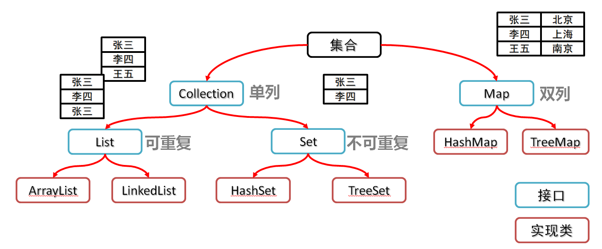

# 1.Collection集合

## 1.1数组和集合的区别

+ 相同点

  都是容器，可以存储多个数据

+ 不同点

  + 数组的长度是不可变的，集合的长度是可变的

  + 数组可以存基本数据类型和引用数据类型

    集合只能存引用数据类型，如果要存基本数据类型，需要存对应的包装类

## 1.2集合类体系结构



## 1.3Collection 集合概述和使用

+ Collection集合概述

  + 是单列集合的顶层接口，它表示一组对象，这些对象也称为Collection的元素
  + JDK 不提供此接口的任何直接实现。它提供更具体的子接口(如Set和List)实现

+ 创建Collection集合的对象

  + 多态的方式
  + 具体的实现类ArrayList

+ Collection集合常用方法

  | 方法名                     | 说明                               |
  | :------------------------- | :--------------------------------- |
  | boolean add(E e)           | 添加元素                           |
  | boolean remove(Object o)   | 从集合中移除指定的元素             |
  | boolean removeIf(Object o) | 根据条件进行移除                   |
  | void   clear()             | 清空集合中的元素                   |
  | boolean contains(Object o) | 判断集合中是否存在指定的元素       |
  | boolean isEmpty()          | 判断集合是否为空                   |
  | int   size()               | 集合的长度，也就是集合中元素的个数 |

## 1.4Collection集合的遍历

### 迭代器介绍

+ 迭代器，集合的专用遍历方式
+ Iterator<E> iterator()： 返回此集合中元素的迭代器，通过集合对象的iterator()方法得到

### Iterator中的常用方法

- boolean hasNext()：判断当前位置是否有元素可以被取出
- E next()：获取当前位置的元素，将迭代器对象移向下一个索引位置

### Collection集合的遍历

```java
package com.iflytek.day19;

import java.util.ArrayList;
import java.util.Collection;
import java.util.Iterator;

public class _01_IteratorDemo {
    public static void main(String[] args) {
        //创建集合对象
        Collection<String> c = new ArrayList<>();

        //添加元素
        c.add("hello");
        c.add("world");
        c.add("java");
        c.add("javaee");

        //Iterator<E> iterator()：返回此集合中元素的迭代器，通过集合的iterator()方法得到
        Iterator<String> it = c.iterator();

        //用while循环改进元素的判断和获取
        while (it.hasNext()) {
            String s = it.next();
            System.out.println(s);
        }
    }
}
```

### 迭代器中删除的方法

- void remove()：删除迭代器对象当前指向的元素


```java
package com.iflytek.day19;

import java.util.ArrayList;
import java.util.Iterator;

public class _02_IteratorDemo {
    public static void main(String[] args) {
        ArrayList<String> list = new ArrayList<>();
        list.add("a");
        list.add("b");
        list.add("b");
        list.add("c");
        list.add("d");

        Iterator<String> it = list.iterator();
        while(it.hasNext()){
            String s = it.next();
            if("b".equals(s)){
                //指向谁,那么此时就删除谁.
                it.remove();
            }
        }
        System.out.println(list);
    }
}
```

## 1.5增强for循环

### 介绍

+ 它是JDK5之后出现的，其内部原理是一个Iterator迭代器
+ 实现Iterable接口的类才可以使用迭代器和增强for
+ 简化数组和Collection集合的遍历

### 格式

​	

```java
for(集合/数组中元素的数据类型 变量名 :  集合/数组名) {
	// 已经将当前遍历到的元素封装到变量中了,直接使用变量即可
}
```


### 代码

```java
package com.iflytek.day19;

import java.util.ArrayList;

public class _03_CollectonDemo {
    public static void main(String[] args) {
        ArrayList<String> list = new ArrayList<>();
        list.add("a");
        list.add("b");
        list.add("c");
        list.add("d");
        list.add("e");
        list.add("f");

        //1,数据类型一定是集合或者数组中元素的类型
        //2,str仅仅是一个变量名而已,在循环的过程中,依次表示集合或者数组中的每一个元素
        //3,list就是要遍历的集合或者数组
        for (String str : list) {
            System.out.println(str);
        }
    }
}
```

# 2.List集合

## 2.1List集合的概述和特点

### List集合的概述

+ 有序集合，这里的有序指的是存取顺序
+ 用户可以精确控制列表中每个元素的插入位置，用户可以通过整数索引访问元素，并搜索列表中的元素
+ 与Set集合不同，列表通常允许重复的元素

### List集合的特点

+ 存取有序
+ 可以重复
+ 有索引

## 2.2List集合的特有方法

| 方法名                          | 描述                                   |
| ------------------------------- | -------------------------------------- |
| void add(int index,E   element) | 在此集合中的指定位置插入指定的元素     |
| E remove(int   index)           | 删除指定索引处的元素，返回被删除的元素 |
| E set(int index,E   element)    | 修改指定索引处的元素，返回被修改的元素 |
| E get(int   index)              | 返回指定索引处的元素                   |

# 3.数据结构

## 3.1数据结构之栈和队列

- 栈结构

  ​	先进后出

- 队列结构

  ​	先进先出

## 3.2数据结构之数组和链表

- 数组结构

  ​	查询快、增删慢

- 链表结构

  ​	查询慢、增删快


# 4.List集合的实现类

## 4.1List集合子类的特点

- ArrayList集合

  ​	底层是数组结构实现，查询快、增删慢

- LinkedList集合

  ​	底层是链表结构实现，查询慢、增删快


## 4.2 ArrayList集合的特有功能

### 4.2.1 ArrayList的构造方法和添加方法

| public ArrayList()                   | 创建一个空的集合对象               |
| ------------------------------------ | ---------------------------------- |
| public boolean add(E e)              | 将指定的元素追加到此集合的末尾     |
| public void add(int index,E element) | 在此集合中的指定位置插入指定的元素 |

**ArrayList<E> ：** 

​	可调整大小的数组实现 

​	<E> : 是一种特殊的数据类型，泛型。

**怎么用呢 ?**	

​	在出现E的地方我们使用引用数据类型替换即可	

​	举例：ArrayList<String>, ArrayList<Student>


### 4.2.2 ArrayList类常用方法

**成员方法 : **

| public boolean remove(Object o)   | 删除指定的元素，返回删除是否成功       |
| --------------------------------- | -------------------------------------- |
| public E remove(int index)        | 删除指定索引处的元素，返回被删除的元素 |
| public E set(int index,E element) | 修改指定索引处的元素，返回被修改的元素 |
| public E get(int index)           | 返回指定索引处的元素                   |
| public int size()                 | 返回集合中的元素的个数                 |

**示例代码 :** 

```java
package com.iflytek.day19.list;

import java.util.ArrayList;

public class ArrayListDemo01 {
    public static void main(String[] args) {
        //创建集合
        ArrayList<String> array = new ArrayList<String>();

        //添加元素
        array.add("hello");
        array.add("world");
        array.add("java");
        array.add("Spring");
        array.add("mybatis");
        array.add("hibernate");
        array.add("hadoop");
        array.add("hive");

        //public boolean remove(Object o)：删除指定的元素，返回删除是否成功
        System.out.println(array.remove("world"));
        System.out.println(array.remove("javaee"));

        //public E remove(int index)：删除指定索引处的元素，返回被删除的元素
        System.out.println(array.remove(1));

        //IndexOutOfBoundsException
        System.out.println(array.remove(3));

        //public E set(int index,E element)：修改指定索引处的元素，返回被修改的元素
        System.out.println(array.set(1, "javaee"));

        //IndexOutOfBoundsException
        System.out.println(array.set(20, "javaee"));

        //public E get(int index)：返回指定索引处的元素
        System.out.println(array.get(0));
        System.out.println(array.get(1));x
        System.out.println(array.get(2));
        System.out.println(array.get(20)); //？？？？？？ 自己测试

        //public int size()：返回集合中的元素的个数
        System.out.println(array.size());

        //输出集合
        System.out.println("array:" + array);
    }
}
```


### 4.2.3 ArrayList存储字符串并遍历

**案例需求 :** 

​	创建一个存储字符串的集合，存储3个字符串元素，使用程序实现在控制台遍历该集合

**实现步骤 :** 

1. 创建集合对象
2. 往集合中添加字符串对象
3. 遍历集合，首先要能够获取到集合中的每一个元素，这个通过get(int index)方法实现
4. 遍历集合，其次要能够获取到集合的长度，这个通过size()方法实现
5. 遍历集合的通用格式

**代码实现 :** 

```java
package com.iflytek.day19.list;

import java.util.ArrayList;

/*
    思路：
        1:创建集合对象
        2:往集合中添加字符串对象
        3:遍历集合，首先要能够获取到集合中的每一个元素，这个通过get(int index)方法实现
        4:遍历集合，其次要能够获取到集合的长度，这个通过size()方法实现
        5:遍历集合的通用格式
 */
public class ArrayListDemo02 {
    public static void main(String[] args) {
        //创建集合对象
        ArrayList<String> array = new ArrayList<String>();

        //往集合中添加字符串对象
        array.add("刘正风");
        array.add("左冷禅");
        array.add("风清扬");

        //遍历集合，其次要能够获取到集合的长度，这个通过size()方法实现
//        System.out.println(array.size());

        //遍历集合的通用格式
        for(int i=0; i<array.size(); i++) {
            String s = array.get(i);
            System.out.println(s);
        }
    }
}
```

### 4.2.4  ArrayList存储学生对象并遍历

**案例需求 :** 

​	创建一个存储学生对象的集合，存储3个学生对象，使用程序实现在控制台遍历该集合

**实现步骤 : ** 

​	1:定义学生类    

​	2:创建集合对象    

​	3:创建学生对象    

​	4:添加学生对象到集合中    

​	5:遍历集合，采用通用遍历格式实现

**代码实现 :**

```java
package com.iflytek.day19.list;

import java.util.ArrayList;

/*
    思路：
        1:定义学生类
        2:创建集合对象
        3:创建学生对象
        4:添加学生对象到集合中
        5:遍历集合，采用通用遍历格式实现
 */
public class ArrayListDemo03 {
    public static void main(String[] args) {
        //创建集合对象
        ArrayList<Student> array = new ArrayList<>();

        //创建学生对象
        Student s1 = new Student("林青霞", 30);
        Student s2 = new Student("风清扬", 33);
        Student s3 = new Student("张曼玉", 18);

        //添加学生对象到集合中
        array.add(s1);
        array.add(s2);
        array.add(s3);

        //遍历集合，采用通用遍历格式实现
        for (int i = 0; i < array.size(); i++) {
            Student s = array.get(i);
            System.out.println(s.getName() + "," + s.getAge());
        }
    }
}

class Student {
    private String name;
    private int age;

    public Student() {
    }

    public Student(String name, int age) {
        this.name = name;
        this.age = age;
    }

    public String getName() {
        return name;
    }

    public void setName(String name) {
        this.name = name;
    }

    public int getAge() {
        return age;
    }

    public void setAge(int age) {
        this.age = age;
    }
}

```

### 4.2.5  键盘录入学生信息到集合

**案例需求 :** 

- 创建一个存储学生对象的集合，存储3个学生对象，使用程序实现在控制台遍历该集合
- 学生的姓名和年龄来自于键盘录入

**实现步骤 :**

1. 定义学生类，为了键盘录入数据方便，把学生类中的成员变量都定义为String类型    

2. 创建集合对象    

3. 键盘录入学生对象所需要的数据    

4. 创建学生对象，把键盘录入的数据赋值给学生对象的成员变量    

5. 往集合中添加学生对象    

6. 遍历集合，采用通用遍历格式实现


**代码实现 :** 

```java
package com.iflytek.day19.list;

import java.util.ArrayList;
import java.util.Scanner;

/*
    思路：
        1:定义学生类，为了键盘录入数据方便，把学生类中的成员变量都定义为String类型
        2:创建集合对象
        3:键盘录入学生对象所需要的数据
        4:创建学生对象，把键盘录入的数据赋值给学生对象的成员变量
        5:往集合中添加学生对象
        6:遍历集合，采用通用遍历格式实现
 */
public class ArrayListDemo04 {
    public static void main(String[] args) {
        //创建集合对象
        ArrayList<Student> array = new ArrayList<Student>();

        //为了提高代码的复用性，我们用方法来改进程序
        addStudent(array);
        addStudent(array);
        addStudent(array);

        //遍历集合，采用通用遍历格式实现
        for (int i = 0; i < array.size(); i++) {
            Student s = array.get(i);
            System.out.println(s.getName() + "," + s.getAge());
        }
    }

    /*
        两个明确：
            返回值类型：void
            参数：ArrayList<Student> array
     */
    public static void addStudent(ArrayList<Student> array) {
        //键盘录入学生对象所需要的数据
        Scanner sc = new Scanner(System.in);

        System.out.println("请输入学生姓名:");
        String name = sc.nextLine();

        System.out.println("请输入学生年龄:");
        int age = sc.nextInt();

        //创建学生对象，把键盘录入的数据赋值给学生对象的成员变量
        Student s = new Student();
        s.setName(name);
        s.setAge(age);

        //往集合中添加学生对象
        array.add(s);
    }
}
```


## 4.3LinkedList集合的特有功能

特有方法

| 方法名                    | 说明                             |
| ------------------------- | -------------------------------- |
| public void addFirst(E e) | 在该列表开头插入指定的元素       |
| public void addLast(E e)  | 将指定的元素追加到此列表的末尾   |
| public E getFirst()       | 返回此列表中的第一个元素         |
| public   E getLast()      | 返回此列表中的最后一个元素       |
| public E removeFirst()    | 从此列表中删除并返回第一个元素   |
| public   E removeLast()   | 从此列表中删除并返回最后一个元素 |


# 5.泛型

## 5.1泛型概述

### 泛型的介绍

​	泛型是JDK5中引入的特性，它提供了编译时类型安全检测机制

### 泛型的好处

1. 把运行时期的问题提前到了编译期间
2. 避免了强制类型转换

### 泛型的定义格式

+ <类型>：指定一种类型的格式。尖括号里面可以任意书写，一般只写一个字母。例如：<E> <T>
+ <类型1,类型2…>：指定多种类型的格式,多种类型之间用逗号隔开。例如：<E,T> <K,V>

## 5.2泛型类

### 定义格式

```java
修饰符 class 类名<类型> {  }
```

### 示例代码

- 泛型类

  ```java
  package com.iflytek.day19.generic;
  
  public class Generic<T> {
      private T t;
  
      public T getT() {
          return t;
      }
  
      public void setT(T t) {
          this.t = t;
      }
  }
  ```

- 测试类

  ```java
  package com.iflytek.day19.generic;
  
  public class GenericDemo01 {
      public static void main(String[] args) {
          Generic<String> g1 = new Generic<String>();
          g1.setT("杨幂");
          System.out.println(g1.getT());
  
          Generic<Integer> g2 = new Generic<Integer>();
          g2.setT(30);
          System.out.println(g2.getT());
  
          Generic<Boolean> g3 = new Generic<Boolean>();
          g3.setT(true);
          System.out.println(g3.getT());
      }
  }
  ```

## 5.3泛型方法

### 定义格式

```java
修饰符 <类型> 返回值类型 方法名(类型 变量名) {  }
```

### 示例代码

- 带有泛型方法的类

  ```java
  public class Generic02 {
      public <T> void show(T t) {
          System.out.println(t);
      }
  }
  ```

- 测试类

  ```java
  package test;
  
  public class GenericDemo02 {
      public static void main(String[] args) {
          Generic02 g = new Generic02();
          g.show("柳岩");
          g.show(30);
          g.show(true);
          g.show(12.34);
      }
  }
  ```

## 5.4泛型接口

### 定义格式

```java
修饰符 interface 接口名<类型> {  }
```

### 示例代码

- 泛型接口

  ```java
  public interface Generic03<T> {
      void show(T t);
  }
  ```

- 泛型接口实现类1

  ​	定义实现类时，定义和接口相同泛型，创建实现类对象时明确泛型的具体类型

  ```java
  public class GenericImpl01<T> implements Generic03<T> {
      @Override
      public void show(T t) {
          System.out.println(t);
      }
  }
  ```

- 泛型接口实现类2

  ​	定义实现类时，直接明确泛型的具体类型

  ```java
  public class GenericImpl02 implements Generic03<Integer>{
       @Override
       public void show(Integer t) {
            System.out.println(t);
       }
  }
  ```

- 测试类

  ```java
  public class GenericDemo03 {
      public static void main(String[] args) {
          GenericImpl01<String> g1 = new GenericImpl<String>();
          g1.show("林青霞");
          GenericImpl01<Integer> g2 = new GenericImpl<Integer>();
          g2.show(30);
        
          GenericImpl02 g3 = new GenericImpl02();
        	g3.show(10);
      }
  }
  
  ```

## 5.5类型通配符

- 类型通配符：<?>

  - ArrayList<?>：表示元素类型未知的ArrayList，它的元素可以匹配任何的类型
  - 但是并不能把元素添加到ArrayList中了，获取出来的也是父类类型

- 类型通配符上限：<? extends 类型>

  - ArrayListList <? extends Number>：它表示的类型是Number或者其子类型

- 类型通配符下限：<? super 类型>

  - ArrayListList <? super Number>：它表示的类型是Number或者其父类型

- 泛型通配符的使用

  ```java
  package com.iflytek.day19.generic;
  
  import java.util.ArrayList;
  
  public class GenericDemo04 {
      public static void main(String[] args) {
          ArrayList<Integer> list1 = new ArrayList<>();
          ArrayList<String> list2 = new ArrayList<>();
          ArrayList<Number> list3 = new ArrayList<>();
          ArrayList<Object> list4 = new ArrayList<>();
  
          method(list1);
          method(list2);
          method(list3);
          method(list4);
  
          getElement1(list1);
  //        getElement1(list2);//报错
          getElement1(list3);
  //        getElement1(list4);//报错
  
  //        getElement2(list1);//报错
  //        getElement2(list2);//报错
          getElement2(list3);
          getElement2(list4);
      }
    
      // 泛型通配符：此时的泛型?，可以是任意类型
      public static void method(ArrayList<?> list){}
      // 泛型的上限：此时的泛型?，必须是Number类型或者Number类型的子类
      public static void getElement1(ArrayList<? extends Number> list){}
      // 泛型的下限：此时的泛型?，必须是Number类型或者Number类型的父类
      public static void getElement2(ArrayList<? super Number> list){}
  
  }
  ```


# 6.Set集合

## 6.1Set集合概述和特点

+ 不可以存储重复元素
+ 没有索引，不能使用普通for循环遍历

# 7.HashSet集合

## 7.1HashSet集合概述和特点

+ 底层数据结构是哈希表
+ 存取无序
+ 不可以存储重复元素
+ 没有索引，不能使用普通for循环遍历

## 7.2HashSet集合的基本应用

存储字符串并遍历

```java
package com.iflytek.day19.set;

import java.util.HashSet;

public class HashSetDemo01 {
    public static void main(String[] args) {
        //创建集合对象
        HashSet<String> set = new HashSet<String>();

        //添加元素
        set.add("hello");
        set.add("world");
        set.add("java");
        //不包含重复元素的集合
        set.add("world");

        //遍历
        for(String s : set) {
            System.out.println(s);
        }
    }
}
```

## 7.3HashSet集合存储学生对象并遍历

### 案例需求

- 创建一个存储学生对象的集合，存储多个学生对象，使用程序实现在控制台遍历该集合
- 要求：学生对象的成员变量值相同，我们就认为是同一个对象

### 代码实现

- 学生类


```java
package com.iflytek.day19.set;

public class Student {
    private String name;
    private int age;

    public Student() {
    }

    public Student(String name, int age) {
        this.name = name;
        this.age = age;
    }

    public String getName() {
        return name;
    }

    public void setName(String name) {
        this.name = name;
    }

    public int getAge() {
        return age;
    }

    public void setAge(int age) {
        this.age = age;
    }

    @Override
    public boolean equals(Object o) {
        if (this == o) return true;
        if (o == null || getClass() != o.getClass()) return false;

        Student student = (Student) o;

        if (age != student.age) return false;
        return name != null ? name.equals(student.name) : student.name == null;
    }

    @Override
    public int hashCode() {
        int result = name != null ? name.hashCode() : 0;
        result = 31 * result + age;
        return result;
    }
}
```

- 测试类


```java
package com.iflytek.day19.set;

import java.util.HashSet;

public class HashSetDemo02 {
    public static void main(String[] args) {
        //创建HashSet集合对象
        HashSet<Student> hs = new HashSet<Student>();

        //创建学生对象
        Student s1 = new Student("林青霞", 30);
        Student s2 = new Student("张曼玉", 35);
        Student s3 = new Student("王祖贤", 33);

        Student s4 = new Student("王祖贤", 33);

        //把学生添加到集合
        hs.add(s1);
        hs.add(s2);
        hs.add(s3);
        hs.add(s4);

        //遍历集合(增强for)
        for (Student s : hs) {
            System.out.println(s.getName() + "," + s.getAge());
        }
    }
}
```

- 总结

  ​	HashSet集合存储自定义类型元素，要想实现元素的唯一，要求必须重写hashCode方法和equals方法


# 8.Map集合

## 8.1Map集合概述和特点

### Map集合概述

```java
interface Map<K,V>  K：键的类型；V：值的类型
```


### Map集合的特点

- 双列集合，一个键对应一个值
- 键不可以重复，值可以重复


### Map集合的基本使用

```java
package com.iflytek.day19.map;

import java.util.HashMap;
import java.util.Map;

public class MapDemo01 {
    public static void main(String[] args) {
        //创建集合对象
        Map<String, String> map = new HashMap<String, String>();

        //V put(K key, V value) 将指定的值与该映射中的指定键相关联
        map.put("sias001", "林青霞");
        map.put("sias002", "张曼玉");
        map.put("sias003", "王祖贤");
        map.put("sias003", "柳岩");

        //输出集合对象
        System.out.println(map);
    }
}
```

## 8.2Map集合的基本功能

### 方法介绍

| 方法名                              | 说明                                 |
| ----------------------------------- | ------------------------------------ |
| V   put(K key,V   value)            | 添加元素                             |
| V   remove(Object key)              | 根据键删除键值对元素                 |
| void   clear()                      | 移除所有的键值对元素                 |
| boolean containsKey(Object key)     | 判断集合是否包含指定的键             |
| boolean containsValue(Object value) | 判断集合是否包含指定的值             |
| boolean isEmpty()                   | 判断集合是否为空                     |
| int size()                          | 集合的长度，也就是集合中键值对的个数 |


### 示例代码

```java
package com.iflytek.day19.map;

import java.util.HashMap;
import java.util.Map;

public class MapDemo02 {
    public static void main(String[] args) {
        //创建集合对象
        Map<String, String> map = new HashMap<String, String>();

        //V put(K key,V value)：添加元素
        map.put("张无忌", "赵敏");
        map.put("郭靖", "黄蓉");
        map.put("杨过", "小龙女");
        map.put("耶律齐", "郭芙");

        //V remove(Object key)：根据键删除键值对元素
        System.out.println(map.remove("郭靖"));
        System.out.println(map.remove("郭襄"));

        //void clear()：移除所有的键值对元素
//        map.clear();

        //boolean containsKey(Object key)：判断集合是否包含指定的键
        System.out.println(map.containsKey("张无忌"));
        System.out.println(map.containsKey("郭襄"));

        //boolean isEmpty()：判断集合是否为空
        System.out.println(map.isEmpty());

        //int size()：集合的长度，也就是集合中键值对的个数
        System.out.println(map.size());

        //输出集合对象
        System.out.println(map);
    }
}
```

## 8.3Map集合的获取功能

### 方法介绍

| 方法名                           | 说明                     |
| -------------------------------- | ------------------------ |
| V   get(Object key)              | 根据键获取值             |
| Set<K>   keySet()                | 获取所有键的集合         |
| Collection<V>   values()         | 获取所有值的集合         |
| Set<Map.Entry<K,V>>   entrySet() | 获取所有键值对对象的集合 |

### 示例代码

```java
package com.iflytek.day19.map;

import java.util.Collection;
import java.util.HashMap;
import java.util.Map;

public class MapDemo03 {
    public static void main(String[] args) {
        //创建集合对象
        Map<String, String> map = new HashMap<String, String>();

        //添加元素
        map.put("张无忌", "赵敏");
        map.put("郭靖", "黄蓉");
        map.put("杨过", "小龙女");

        //V get(Object key):根据键获取值
//        System.out.println(map.get("张无忌"));
//        System.out.println(map.get("张三丰"));

        //Set<K> keySet():获取所有键的集合
//        Set<String> keySet = map.keySet();
//        for(String key : keySet) {
//            System.out.println(key);
//        }

        //Collection<V> values():获取所有值的集合
        Collection<String> values = map.values();
        for (String value : values) {
            System.out.println(value);
        }
    }
}
```

## 8.4Map集合的遍历(方式1)

### 遍历思路

- 我们刚才存储的元素都是成对出现的，所以我们把Map看成是一个夫妻对的集合
  - 把所有的丈夫给集中起来
  - 遍历丈夫的集合，获取到每一个丈夫
  - 根据丈夫去找对应的妻子

### 步骤分析

- 获取所有键的集合。用keySet()方法实现
- 遍历键的集合，获取到每一个键。用增强for实现  
- 根据键去找值。用get(Object key)方法实现

### 代码实现

```java
package com.iflytek.day19.map;

import java.util.HashMap;
import java.util.Map;
import java.util.Set;

public class MapDemo04 {
    public static void main(String[] args) {
        //创建集合对象
        Map<String, String> map = new HashMap<String, String>();

        //添加元素
        map.put("张无忌", "赵敏");
        map.put("郭靖", "黄蓉");
        map.put("杨过", "小龙女");

        //获取所有键的集合。用keySet()方法实现
        Set<String> keySet = map.keySet();
        //遍历键的集合，获取到每一个键。用增强for实现
        for (String key : keySet) {
            //根据键去找值。用get(Object key)方法实现
            String value = map.get(key);
            System.out.println(key + "," + value);
        }
    }
}
```

## 8.5Map集合的遍历(方式2)

### 遍历思路

- 我们刚才存储的元素都是成对出现的，所以我们把Map看成是一个夫妻对的集合
  - 获取所有结婚证的集合
  - 遍历结婚证的集合，得到每一个结婚证
  - 根据结婚证获取丈夫和妻子

### 步骤分析

- 获取所有键值对对象的集合
  - Set<Map.Entry<K,V>> entrySet()：获取所有键值对对象的集合
- 遍历键值对对象的集合，得到每一个键值对对象
  - 用增强for实现，得到每一个Map.Entry
- 根据键值对对象获取键和值
  - 用getKey()得到键
  - 用getValue()得到值

### 代码实现

```java
package com.iflytek.day19.map;

import java.util.HashMap;
import java.util.Map;
import java.util.Set;

public class MapDemo05 {
    public static void main(String[] args) {
        //创建集合对象
        Map<String, String> map = new HashMap<String, String>();

        //添加元素
        map.put("张无忌", "赵敏");
        map.put("郭靖", "黄蓉");
        map.put("杨过", "小龙女");

        //获取所有键值对对象的集合
        Set<Map.Entry<String, String>> entrySet = map.entrySet();
        //遍历键值对对象的集合，得到每一个键值对对象
        for (Map.Entry<String, String> me : entrySet) {
            //根据键值对对象获取键和值
            String key = me.getKey();
            String value = me.getValue();
            System.out.println(key + "," + value);
        }
    }
}
```

# 9.HashMap集合

## 9.1HashMap集合概述和特点

+ HashMap底层是哈希表结构的
+ 依赖hashCode方法和equals方法保证键的唯一
+ 如果键要存储的是自定义对象，需要重写hashCode和equals方法

## 9.2HashMap集合应用案例

### 案例需求

- 创建一个HashMap集合，键是学生对象(Student)，值是居住地 (String)。存储多个元素，并遍历。
- 要求保证键的唯一性：如果学生对象的成员变量值相同，我们就认为是同一个对象


### 代码实现

学生类

```java
package com.iflytek.day19.map;

import java.util.Objects;

public class Student {
    private String name;
    private int age;

    public Student() {
    }

    public Student(String name, int age) {
        this.name = name;
        this.age = age;
    }

    public String getName() {
        return name;
    }

    public void setName(String name) {
        this.name = name;
    }

    public int getAge() {
        return age;
    }

    public void setAge(int age) {
        this.age = age;
    }

    @Override
    public boolean equals(Object o) {
        if (this == o) return true;
        if (o == null || getClass() != o.getClass()) return false;
        Student student = (Student) o;
        return age == student.age && Objects.equals(name, student.name);
    }

    @Override
    public int hashCode() {
        return Objects.hash(name, age);
    }
}
```

测试类

```java
package com.iflytek.day19.map;

import java.util.HashMap;
import java.util.Set;

public class HashMapDemo {
    public static void main(String[] args) {
        //创建HashMap集合对象
        HashMap<Student, String> hm = new HashMap<Student, String>();

        //创建学生对象
        Student s1 = new Student("林青霞", 30);
        Student s2 = new Student("张曼玉", 35);
        Student s3 = new Student("王祖贤", 33);
        Student s4 = new Student("王祖贤", 33);

        //把学生添加到集合
        hm.put(s1, "西安");
        hm.put(s2, "武汉");
        hm.put(s3, "郑州");
        hm.put(s4, "北京");

        //遍历集合
        Set<Student> keySet = hm.keySet();
        for (Student key : keySet) {
            String value = hm.get(key);
            System.out.println(key.getName() + "," + key.getAge() + "," + value);
        }
    }
}
```

