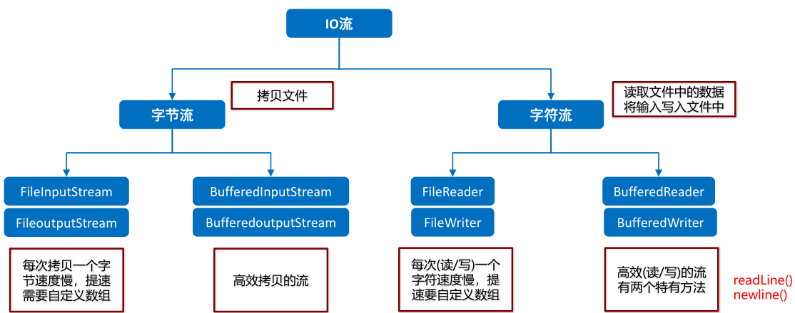

# 1.File类

## 1.1File类概述和构造方法

- File类介绍

  - 它是文件和目录路径名的抽象表示
  - 文件和目录是可以通过File封装成对象的
  - 对于File而言,其封装的并不是一个真正存在的文件,仅仅是一个路径名而已.它可以是存在的,也可以是不存在的.将来是要通过具体的操作把这个路径的内容转换为具体存在的

- File类的构造方法

  | 方法名                              | 说明                                                        |
  | ----------------------------------- | ----------------------------------------------------------- |
  | File(String   pathname)             | 通过将给定的路径名字符串转换为抽象路径名来创建新的 File实例 |
  | File(String   parent, String child) | 从父路径名字符串和子路径名字符串创建新的   File实例         |
  | File(File   parent, String child)   | 从父抽象路径名和子路径名字符串创建新的   File实例           |

- 示例代码

  ```java
  package com.iflytek.day20.file;
  
  import java.io.File;
  
  public class FileDemo01 {
      public static void main(String[] args) {
          //File(String pathname): 通过将给定的路径名字符串转换为抽象路径名来创建新的 File实例
          File f1 = new File("E:\\sias\\java.txt");
          System.out.println(f1);
  
          //File(String parent, String child): 从父路径名字符串和子路径名字符串创建新的 File实例
          File f2 = new File("E:\\sias", "java.txt");
          System.out.println(f2);
  
          //File(File parent, String child): 从父抽象路径名和子路径名字符串创建新的 File实例
          File f3 = new File("E:\\sias");
          File f4 = new File(f3, "java.txt");
          System.out.println(f4);
      }
  }
  ```

## 1.2绝对路径和相对路径

+ 绝对路径

  是一个完整的路径,从盘符开始

+ 相对路径

  是一个简化的路径,相对当前项目下的路径

+ 示例代码

  ```java
  package com.iflytek.day20.file;
  
  import java.io.File;
  
  public class FileDemo02 {
      public static void main(String[] args) {
          // 是一个完整的路径,从盘符开始
          File file1 = new File("D:\\sias\\a.txt");
  
          // 是一个简化的路径,从当前项目根目录开始
          File file2 = new File("a.txt");
          File file3 = new File("模块名\\a.txt");
      }
  }
  ```

## 1.3File类创建功能

- 方法分类

  | 方法名                         | 说明                                                         |
  | ------------------------------ | ------------------------------------------------------------ |
  | public boolean createNewFile() | 当具有该名称的文件不存在时，创建一个由该抽象路径名命名的新空文件 |
  | public boolean mkdir()         | 创建由此抽象路径名命名的目录                                 |
  | public boolean mkdirs()        | 创建由此抽象路径名命名的目录，包括任何必需但不存在的父目录   |

- 示例代码

  ```java
  package com.iflytek.day20.file;
  
  import java.io.File;
  import java.io.IOException;
  
  public class FileDemo03 {
      public static void main(String[] args) throws IOException {
          //需求1：我要在E:\\sias目录下创建一个文件java.txt
          File f1 = new File("E:\\sias\\java.txt");
          System.out.println(f1.createNewFile());
          System.out.println("--------");
  
          //需求2：我要在E:\\sias目录下创建一个目录JavaSE
          File f2 = new File("E:\\sias\\JavaSE");
          System.out.println(f2.mkdir());
          System.out.println("--------");
  
          //需求3：我要在E:\\sias目录下创建一个多级目录JavaWEB\\HTML
          File f3 = new File("E:\\sias\\JavaWEB\\HTML");
  //        System.out.println(f3.mkdir());
          System.out.println(f3.mkdirs());
          System.out.println("--------");
  
          //需求4：我要在E:\\sias目录下创建一个文件javase.txt
          File f4 = new File("E:\\sias\\javase.txt");
  //        System.out.println(f4.mkdir());
          System.out.println(f4.createNewFile());
      }
  }
  ```

## 1.4File类删除功能

- 方法分类

  | 方法名                    | 说明                               |
  | ------------------------- | ---------------------------------- |
  | public boolean   delete() | 删除由此抽象路径名表示的文件或目录 |

- 示例代码

  ```java
  package com.iflytek.day20.file;
  
  import java.io.File;
  import java.io.IOException;
  
  public class FileDemo04 {
      public static void main(String[] args) throws IOException {
  //        File f1 = new File("E:\\sias\\java.txt");
          //需求1：在当前模块目录下创建java.txt文件
          File f1 = new File("myFile\\java.txt");
  //        System.out.println(f1.createNewFile());
  
          //需求2：删除当前模块目录下的java.txt文件
          System.out.println(f1.delete());
          System.out.println("--------");
  
          //需求3：在当前模块目录下创建sias目录
          File f2 = new File("myFile\\sias");
  //        System.out.println(f2.mkdir());
  
          //需求4：删除当前模块目录下的sias目录
          System.out.println(f2.delete());
          System.out.println("--------");
  
          //需求5：在当前模块下创建一个目录sias,然后在该目录下创建一个文件java.txt
          File f3 = new File("myFile\\sias");
  //        System.out.println(f3.mkdir());
          File f4 = new File("myFile\\sias\\java.txt");
  //        System.out.println(f4.createNewFile());
  
          //需求6：删除当前模块下的目录sias
          System.out.println(f4.delete());
          System.out.println(f3.delete());
      }
  }
  ```

## 1.5File类判断和获取功能

- 判断功能

  | 方法名                         | 说明                                 |
  | ------------------------------ | ------------------------------------ |
  | public   boolean isDirectory() | 测试此抽象路径名表示的File是否为目录 |
  | public   boolean isFile()      | 测试此抽象路径名表示的File是否为文件 |
  | public   boolean   exists()    | 测试此抽象路径名表示的File是否存在   |

- 获取功能

  | 方法名                            | 说明                                                   |
  | --------------------------------- | ------------------------------------------------------ |
  | public   String getAbsolutePath() | 返回此抽象路径名的绝对路径名字符串                     |
  | public   String getPath()         | 将此抽象路径名转换为路径名字符串                       |
  | public   String getName()         | 返回由此抽象路径名表示的文件或目录的名称               |
  | public   File[] listFiles()       | 返回此抽象路径名表示的目录中的文件和目录的File对象数组 |

- 示例代码

  ```java
  package com.iflytek.day20.file;
  
  import java.io.File;
  
  public class FileDemo05 {
      public static void main(String[] args) {
          //创建一个File对象
          File f = new File("myFile\\java.txt");
  
  //        public boolean isDirectory()：测试此抽象路径名表示的File是否为目录
  //        public boolean isFile()：测试此抽象路径名表示的File是否为文件
  //        public boolean exists()：测试此抽象路径名表示的File是否存在
          System.out.println(f.isDirectory());
          System.out.println(f.isFile());
          System.out.println(f.exists());
  
  //        public String getAbsolutePath()：返回此抽象路径名的绝对路径名字符串
  //        public String getPath()：将此抽象路径名转换为路径名字符串
  //        public String getName()：返回由此抽象路径名表示的文件或目录的名称
          System.out.println(f.getAbsolutePath());
          System.out.println(f.getPath());
          System.out.println(f.getName());
          System.out.println("--------");
  
  //        public File[] listFiles()：返回此抽象路径名表示的目录中的文件和目录的File对象数组
          File f2 = new File("E:\\sias");
          File[] fileArray = f2.listFiles();
          for(File file : fileArray) {
  //            System.out.println(file);
  //            System.out.println(file.getName());
              if(file.isFile()) {
                  System.out.println(file.getName());
              }
          }
      }
  }
  ```

## 1.6File类练习一

+ 案例需求

  在当前模块下的aaa文件夹中创建一个a.txt文件

+ 实现步骤

  + 创建File对象,指向aaa文件夹
  + 判断aaa文件夹是否存在,如果不存在则创建
  + 创建File对象,指向aaa文件夹下的a.txt文件
  + 创建这个文件

+ 代码实现

  ```java
  public class Test1 {
      public static void main(String[] args) throws IOException {
          //练习一：在当前模块下的aaa文件夹中创建一个a.txt文件
         /* File file = new File("filemodule\\aaa\\a.txt");
          file.createNewFile();*/
          //注意点:文件所在的文件夹必须要存在.
  
        	//1.创建File对象,指向aaa文件夹
          File file = new File("filemodule\\aaa");
        	//2.判断aaa文件夹是否存在,如果不存在则创建
          if(!file.exists()){
              //如果文件夹不存在,就创建出来
              file.mkdirs();
          }
        	//3.创建File对象,指向aaa文件夹下的a.txt文件
          File newFile = new File(file,"a.txt");
        	//4.创建这个文件
          newFile.createNewFile();
      }
  }
  ```

## 1.7File类练习二

+ 案例需求

  删除一个多级文件夹

+ 实现步骤

  + 定义一个方法,接收一个File对象
  + 遍历这个File对象,获取它下边的每个文件和文件夹对象
  + 判断当前遍历到的File对象是文件还是文件夹
  + 如果是文件,直接删除
  + 如果是文件夹,递归调用自己,将当前遍历到的File对象当做参数传递
  + 参数传递过来的文件夹File对象已经处理完成,最后直接删除这个空文件夹

+ 代码实现

  ```java
  public class Test2 {
      public static void main(String[] args) {
          //练习二：删除一个多级文件夹
          //delete方法
          //只能删除文件和空文件夹.
          //如果现在要删除一个有内容的文件夹?
          //先删掉这个文件夹里面所有的内容.
          //最后再删除这个文件夹
  
          File src = new File("C:\\Users\\apple\\Desktop\\src");
          deleteDir(src);
      }
    
  	//1.定义一个方法,接收一个File对象
      private static void deleteDir(File src) {
          //先删掉这个文件夹里面所有的内容.
          //递归 方法在方法体中自己调用自己.
          //注意: 可以解决所有文件夹和递归相结合的题目
          //2.遍历这个File对象,获取它下边的每个文件和文件夹对象
          File[] files = src.listFiles();
          //3.判断当前遍历到的File对象是文件还是文件夹
          for (File file : files) {
              //4.如果是文件,直接删除
              if(file.isFile()){
                  file.delete();
              }else{
                  //5.如果是文件夹,递归调用自己,将当前遍历到的File对象当做参数传递
                  deleteDir(file);//参数一定要是src文件夹里面的文件夹File对象
              }
          }
          //6.参数传递过来的文件夹File对象已经处理完成,最后直接删除这个空文件夹
          src.delete();
      }
  
  }
  ```

## 1.8File类练习三

+ 案例需求

  统计一个文件夹中每种文件的个数并打印

  打印格式如下：

    			txt:3个

    			doc:4个

    			jpg:6个

   			 …

+ 实现步骤

  + 定义一个方法,参数是HashMap集合用来统计次数和File对象要统计的文件夹
  + 遍历File对象,获取它下边的每一个文件和文件夹对象
  + 判断当前File对象是文件还是文件夹
  + 如果是文件,判断这种类型文件后缀名在HashMap集合中是否出现过
    + 没出现过,将这种类型文件的后缀名存入集合中,次数存1
    + 出现过,获取这种类型文件的后缀名出现的次数,对其+1,在存回集合中
  + 如果是文件夹,递归调用自己,HashMap集合就是参数集合,File对象是当前文件夹对象

+ 代码实现

  ```java
  public class Test3 {
      public static void main(String[] args) {
          //统计一个文件夹中,每种文件出现的次数.
          //统计 --- 定义一个变量用来统计. ---- 弊端:同时只能统计一种文件
          //利用map集合进行数据统计,键 --- 文件后缀名  值 ----  次数
  
          File file = new File("filemodule");
          HashMap<String, Integer> hm = new HashMap<>();
          getCount(hm, file);
          System.out.println(hm);
      }
    
  	//1.定义一个方法,参数是HashMap集合用来统计次数和File对象要统计的文件夹
      private static void getCount(HashMap<String, Integer> hm, File file) {
        	//2.遍历File对象,获取它下边的每一个文件和文件夹对象
          File[] files = file.listFiles();
          for (File f : files) {
            	//3.判断当前File对象是文件还是文件夹
              if(f.isFile()){
                	//如果是文件,判断这种类型文件后缀名在HashMap集合中是否出现过
                  String fileName = f.getName();
                  String[] fileNameArr = fileName.split("\\.");
                  if(fileNameArr.length == 2){
                      String fileEndName = fileNameArr[1];
                      if(hm.containsKey(fileEndName)){
                          //出现过,获取这种类型文件的后缀名出现的次数,对其+1,在存回集合中
                          Integer count = hm.get(fileEndName);
                          //这种文件又出现了一次.
                          count++;
                          //把已经出现的次数给覆盖掉.
                          hm.put(fileEndName,count);
                      }else{
                          // 没出现过,将这种类型文件的后缀名存入集合中,次数存1
                          hm.put(fileEndName,1);
                      }
                  }
              }else{
                //如果是文件夹,递归调用自己,HashMap集合就是参数集合,File对象是当前文件夹对象代码实现
                  getCount(hm,f);
              }
          }
      }
    
  }
  ```

# 2.字节流

## 2.1 IO流概述和分类

- IO流介绍
  - IO：输入/输出(Input/Output)
  - 流：是一种抽象概念,是对数据传输的总称.也就是说数据在设备间的传输称为流,流的本质是数据传输
  - IO流就是用来处理设备间数据传输问题的.常见的应用: 文件复制; 文件上传; 文件下载
- IO流的分类
  - 按照数据的流向
    - 输入流：读数据
    - 输出流：写数据
  - 按照数据类型来分
    - 字节流
      - 字节输入流
      - 字节输出流
    - 字符流
      - 字符输入流
      - 字符输出流
- IO流的使用场景
  - 如果操作的是纯文本文件,优先使用字符流
  - 如果操作的是图片、视频、音频等二进制文件,优先使用字节流
  - 如果不确定文件类型,优先使用字节流.字节流是万能的流

## 2.2字节流写数据

- 字节流抽象基类

  - InputStream：这个抽象类是表示字节输入流的所有类的超类
  - OutputStream：这个抽象类是表示字节输出流的所有类的超类
  - 子类名特点：子类名称都是以其父类名作为子类名的后缀

- 字节输出流

  - FileOutputStream(String name)：创建文件输出流以指定的名称写入文件

- 使用字节输出流写数据的步骤

  - 创建字节输出流对象(调用系统功能创建了文件,创建字节输出流对象,让字节输出流对象指向文件)
  - 调用字节输出流对象的写数据方法
  - 释放资源(关闭此文件输出流并释放与此流相关联的任何系统资源)

- 示例代码

  ```java
  package com.iflytek.day20.byteStream;
  
  import java.io.FileOutputStream;
  import java.io.IOException;
  
  public class FileOutputStreamDemo01 {
      public static void main(String[] args) throws IOException {
          //创建字节输出流对象
        	/*
        		注意点:
        				1.如果文件不存在,会帮我们创建
        				2.如果文件存在,会把文件清空
        	*/
        	//FileOutputStream(String name)：创建文件输出流以指定的名称写入文件
          FileOutputStream fos = new FileOutputStream("myByteStream\\fos.txt");
  
          //void write(int b)：将指定的字节写入此文件输出流
          fos.write(97);
  //        fos.write(57);
  //        fos.write(55);
  
          //最后都要释放资源
          //void close()：关闭此文件输出流并释放与此流相关联的任何系统资源。
          fos.close();
      }
  }
  ```

## 2.3字节流写数据的三种方式

- 写数据的方法分类

  | 方法名                                   | 说明                                                         |
  | ---------------------------------------- | ------------------------------------------------------------ |
  | void   write(int b)                      | 将指定的字节写入此文件输出流   一次写一个字节数据            |
  | void   write(byte[] b)                   | 将 b.length字节从指定的字节数组写入此文件输出流   一次写一个字节数组数据 |
  | void   write(byte[] b, int off, int len) | 将 len字节从指定的字节数组开始，从偏移量off开始写入此文件输出流   一次写一个字节数组的部分数据 |

- 示例代码

  ```java
  package com.iflytek.day20.byteStream;
  
  import java.io.FileOutputStream;
  import java.io.IOException;
  
  public class FileOutputStreamDemo02 {
      public static void main(String[] args) throws IOException {
          //FileOutputStream(String name)：创建文件输出流以指定的名称写入文件
          FileOutputStream fos = new FileOutputStream("myByteStream\\fos.txt");
          //FileOutputStream(File file)：创建文件输出流以写入由指定的 File对象表示的文件
  //        FileOutputStream fos = new FileOutputStream(new File("myByteStream\\fos.txt"));
  
          //void write(int b)：将指定的字节写入此文件输出流
  //        fos.write(97);
  //        fos.write(98);
  //        fos.write(99);
  //        fos.write(100);
  //        fos.write(101);
  
  //        void write(byte[] b)：将 b.length字节从指定的字节数组写入此文件输出流
  //        byte[] bys = {97, 98, 99, 100, 101};
          //byte[] getBytes()：返回字符串对应的字节数组
          byte[] bys = "abcde".getBytes();
  //        fos.write(bys);
  
          //void write(byte[] b, int off, int len)：将 len字节从指定的字节数组开始，从偏移量off开始写入此文件输出流
  //        fos.write(bys,0,bys.length);
          fos.write(bys,1,3);
  
          //释放资源
          fos.close();
      }
  }
  ```

## 2.4字节流写数据的两个小问题

- 字节流写数据如何实现换行

  - windows:\r\n
  - linux:\n
  - mac:\r

- 字节流写数据如何实现追加写入

  - public FileOutputStream(String name,boolean append)
  - 创建文件输出流以指定的名称写入文件。如果第二个参数为true ，则字节将写入文件的末尾而不是开头

- 示例代码

  ```java
  package com.iflytek.day20.byteStream;
  
  import java.io.FileOutputStream;
  import java.io.IOException;
  
  public class FileOutputStreamDemo03 {
      public static void main(String[] args) throws IOException {
          //创建字节输出流对象
  //        FileOutputStream fos = new FileOutputStream("myByteStream\\fos.txt");
          FileOutputStream fos = new FileOutputStream("myByteStream\\fos.txt",true);
  
          //写数据
          for (int i = 0; i < 10; i++) {
              fos.write("hello".getBytes());
              fos.write("\r\n".getBytes());
          }
  
          //释放资源
          fos.close();
      }
  }
  ```

## 2.5字节流写数据加异常处理

- 异常处理格式

  - try-catch-finally

    ```java
    try{
    	可能出现异常的代码;
    }catch(异常类名 变量名){
    	异常的处理代码;
    }finally{
    	执行所有清除操作;
    }
    ```

  - finally特点

    - 被finally控制的语句一定会执行，除非JVM退出

- 示例代码

  ```java
  package com.iflytek.day20.byteStream;
  
  import java.io.FileOutputStream;
  import java.io.IOException;
  
  public class FileOutputStreamDemo04 {
      public static void main(String[] args) {
          //加入finally来实现释放资源
          FileOutputStream fos = null;
          try {
              fos = new FileOutputStream("myByteStream\\fos.txt");
              fos.write("hello".getBytes());
          } catch (IOException e) {
              e.printStackTrace();
          } finally {
              if(fos != null) {
                  try {
                      fos.close();
                  } catch (IOException e) {
                      e.printStackTrace();
                  }
              }
          }
      }
  }
  ```

## 2.6字节流读数据(一次读一个字节数据)

- 字节输入流

  - FileInputStream(String name)：通过打开与实际文件的连接来创建一个FileInputStream,该文件由文件系统中的路径名name命名

- 字节输入流读取数据的步骤

  - 创建字节输入流对象
  - 调用字节输入流对象的读数据方法
  - 释放资源

- 示例代码

  ```java
  package com.iflytek.day20.byteStream;
  
  import java.io.FileInputStream;
  import java.io.IOException;
  
  public class FileInputStreamDemo01 {
      public static void main(String[] args) throws IOException {
          //创建字节输入流对象
          //FileInputStream(String name)
          FileInputStream fis = new FileInputStream("myByteStream\\fos.txt");
  
          int by;
          /*
              fis.read()：读数据
              by=fis.read()：把读取到的数据赋值给by
              by != -1：判断读取到的数据是否是-1
           */
          while ((by=fis.read())!=-1) {
              System.out.print((char)by);
          }
  
          //释放资源
          fis.close();
      }
  }
  ```

## 2.7字节流复制文件

- 案例需求

  ​	把“E:\\sias\\窗里窗外.txt”复制到模块目录下的“窗里窗外.txt”   (文件可以是任意文件)

- 实现步骤

  - 复制文本文件，其实就把文本文件的内容从一个文件中读取出来(数据源)，然后写入到另一个文件中(目的地)

  - 数据源：

    ​	E:\\sias\\窗里窗外.txt --- 读数据 --- InputStream --- FileInputStream 

  - 目的地：

    ​	myByteStream\\窗里窗外.txt --- 写数据 --- OutputStream --- FileOutputStream

- 代码实现

  ```java
  package com.iflytek.day20.byteStream;
  
  import java.io.FileInputStream;
  import java.io.FileOutputStream;
  import java.io.IOException;
  
  public class CopyTxtDemo {
      public static void main(String[] args) throws IOException {
          //根据数据源创建字节输入流对象
          FileInputStream fis = new FileInputStream("E:\\sias\\窗里窗外.txt");
          //根据目的地创建字节输出流对象
          FileOutputStream fos = new FileOutputStream("myByteStream\\窗里窗外.txt");
  
          //读写数据，复制文本文件(一次读取一个字节，一次写入一个字节)
          int by;
          while ((by=fis.read())!=-1) {
              fos.write(by);
          }
  
          //释放资源
          fos.close();
          fis.close();
      }
  }
  ```

## 2.8字节流读数据(一次读一个字节数组数据)

- 一次读一个字节数组的方法

  - public int read(byte[] b)：从输入流读取最多b.length个字节的数据
  - 返回的是读入缓冲区的总字节数,也就是实际的读取字节个数

- 示例代码

  ```java
  package com.iflytek.day20.byteStream;
  
  import java.io.FileInputStream;
  import java.io.IOException;
  
  public class FileInputStreamDemo02 {
      public static void main(String[] args) throws IOException {
          //创建字节输入流对象
          FileInputStream fis = new FileInputStream("myByteStream\\fos.txt");
  
          byte[] bys = new byte[1024]; //1024及其整数倍
          int len;
        	//循环读取
          while ((len=fis.read(bys))!=-1) {
              System.out.print(new String(bys,0,len));
          }
  
          //释放资源
          fis.close();
      }
  }
  ```

## 2.9字节流复制文件

- 案例需求

  ​	把“E:\\sias\\mn.jpg”复制到模块目录下的“mn.jpg”  (文件可以是任意文件去)

- 实现步骤

  - 根据数据源创建字节输入流对象
  - 根据目的地创建字节输出流对象
  - 读写数据，复制图片(一次读取一个字节数组，一次写入一个字节数组)
  - 释放资源

- 代码实现

  ```java
  package com.iflytek.day20.byteStream;
  
  import java.io.FileInputStream;
  import java.io.FileOutputStream;
  import java.io.IOException;
  
  public class CopyJpgDemo {
      public static void main(String[] args) throws IOException {
          //根据数据源创建字节输入流对象
          FileInputStream fis = new FileInputStream("E:\\sias\\mn.jpg");
          //根据目的地创建字节输出流对象
          FileOutputStream fos = new FileOutputStream("myByteStream\\mn.jpg");
  
          //读写数据，复制图片(一次读取一个字节数组，一次写入一个字节数组)
          byte[] bys = new byte[1024];
          int len;
          while ((len=fis.read(bys))!=-1) {
              fos.write(bys,0,len);
          }
  
          //释放资源
          fos.close();
          fis.close();
      }
  }
  ```

# 3.字节缓冲流

## 3.1字节缓冲流构造方法

- 字节缓冲流介绍

  - lBufferOutputStream：该类实现缓冲输出流.通过设置这样的输出流,应用程序可以向底层输出流写入字节,而不必为写入的每个字节导致底层系统的调用
  - lBufferedInputStream：创建BufferedInputStream将创建一个内部缓冲区数组.当从流中读取或跳过字节时,内部缓冲区将根据需要从所包含的输入流中重新填充,一次很多字节

- 构造方法：

  | 方法名                                 | 说明                   |
  | -------------------------------------- | ---------------------- |
  | BufferedOutputStream(OutputStream out) | 创建字节缓冲输出流对象 |
  | BufferedInputStream(InputStream in)    | 创建字节缓冲输入流对象 |

- 示例代码

  ```java
  package com.iflytek.day20.bufferStream;
  
  import java.io.*;
  
  public class BufferStreamDemo {
      public static void main(String[] args) throws IOException {
          //字节缓冲输出流：BufferedOutputStream(OutputStream out)
   
          BufferedOutputStream bos = new BufferedOutputStream(new FileOutputStream("myByteStream\\bos.txt"));
          //写数据
          bos.write("hello\r\n".getBytes());
          bos.write("world\r\n".getBytes());
          //释放资源
          bos.close();
      
  
          //字节缓冲输入流：BufferedInputStream(InputStream in)
          BufferedInputStream bis = new BufferedInputStream(new FileInputStream("myByteStream\\bos.txt"));
  
          //一次读取一个字节数据
  //        int by;
  //        while ((by=bis.read())!=-1) {
  //            System.out.print((char)by);
  //        }
  
          //一次读取一个字节数组数据
          byte[] bys = new byte[1024];
          int len;
          while ((len=bis.read(bys))!=-1) {
              System.out.print(new String(bys,0,len));
          }
  
          //释放资源
          bis.close();
      }
  }
  ```

## 3.2字节缓冲流复制视频

- 案例需求

  把“E:\\sias\\字节流复制图片.avi”复制到模块目录下的“字节流复制图片.avi”

- 实现步骤

  - 根据数据源创建字节输入流对象
  - 根据目的地创建字节输出流对象
  - 读写数据，复制视频
  - 释放资源

- 代码实现

  ```java
  package com.iflytek.day20.bufferStream;
  
  import java.io.*;
  
  public class CopyAviDemo {
      public static void main(String[] args) throws IOException {
  
          //复制视频
  //        method1();
        	 method2();
  
      }
  
      //字节缓冲流一次读写一个字节数组
      public static void method2() throws IOException {
          BufferedInputStream bis = new BufferedInputStream(new FileInputStream("E:\\sias\\字节流复制图片.avi"));
          BufferedOutputStream bos = new BufferedOutputStream(new FileOutputStream("myByteStream\\字节流复制图片.avi"));
  
          byte[] bys = new byte[1024];
          int len;
          while ((len=bis.read(bys))!=-1) {
              bos.write(bys,0,len);
          }
  
          bos.close();
          bis.close();
      }
  
      //字节缓冲流一次读写一个字节
      public static void method1() throws IOException {
          BufferedInputStream bis = new BufferedInputStream(new FileInputStream("E:\\sias\\字节流复制图片.avi"));
          BufferedOutputStream bos = new BufferedOutputStream(new FileOutputStream("myByteStream\\字节流复制图片.avi"));
  
          int by;
          while ((by=bis.read())!=-1) {
              bos.write(by);
          }
  
          bos.close();
          bis.close();
      }
  
  }
  ```


# 4.字符流

## 4.1为什么会出现字符流

- 字符流的介绍

  由于字节流操作中文不是特别的方便，所以Java就提供字符流

  字符流 = 字节流 + 编码表

- 中文的字节存储方式

  用字节流复制文本文件时，文本文件也会有中文，但是没有问题，原因是最终底层操作会自动进行字节拼接成中文，如何识别是中文的呢？

  汉字在存储的时候，无论选择哪种编码存储，第一个字节都是负数

## 4.2编码表

- 什么是字符集

  是一个系统支持的所有字符的集合，包括各国家文字、标点符号、图形符号、数字等

  l计算机要准确的存储和识别各种字符集符号，就需要进行字符编码，一套字符集必然至少有一套字符编码。常见字符集有ASCII字符集、GBXXX字符集、Unicode字符集等

- 常见的字符集

  - ASCII字符集：

    lASCII：是基于拉丁字母的一套电脑编码系统，用于显示现代英语，主要包括控制字符(回车键、退格、换行键等)和可显示字符(英文大小写字符、阿拉伯数字和西文符号) 

    基本的ASCII字符集，使用7位表示一个字符，共128字符。ASCII的扩展字符集使用8位表示一个字符，共256字符，方便支持欧洲常用字符。是一个系统支持的所有字符的集合，包括各国家文字、标点符号、图形符号、数字等

  - GBXXX字符集：

    GBK：最常用的中文码表。是在GB2312标准基础上的扩展规范，使用了双字节编码方案，共收录了21003个汉字，完全兼容GB2312标准，同时支持繁体汉字以及日韩汉字等

  - Unicode字符集：

    UTF-8编码：可以用来表示Unicode标准中任意字符，它是电子邮件、网页及其他存储或传送文字的应用 中，优先采用的编码。互联网工程工作小组（IETF）要求所有互联网协议都必须支持UTF-8编码。它使用一至四个字节为每个字符编码

    编码规则： 

      128个US-ASCII字符，只需一个字节编码

      拉丁文等字符，需要二个字节编码

      大部分常用字（含中文），使用三个字节编码

      其他极少使用的Unicode辅助字符，使用四字节编码

## 4.3字符串中的编码解码问题

- 相关方法

  | 方法名                                   | 说明                                               |
  | ---------------------------------------- | -------------------------------------------------- |
  | byte[] getBytes()                        | 使用平台的默认字符集将该 String编码为一系列字节    |
  | byte[] getBytes(String charsetName)      | 使用指定的字符集将该 String编码为一系列字节        |
  | String(byte[] bytes)                     | 使用平台的默认字符集解码指定的字节数组来创建字符串 |
  | String(byte[] bytes, String charsetName) | 通过指定的字符集解码指定的字节数组来创建字符串     |

- 代码演示

  ```java
  package com.iflytek.day20.stringStream;
  
  import java.io.UnsupportedEncodingException;
  import java.util.Arrays;
  
  public class StringDemo {
      public static void main(String[] args) throws UnsupportedEncodingException {
          //定义一个字符串
          String s = "中国";
  
          //byte[] bys = s.getBytes(); //[-28, -72, -83, -27, -101, -67]
          //byte[] bys = s.getBytes("UTF-8"); //[-28, -72, -83, -27, -101, -67]
          byte[] bys = s.getBytes("GBK"); //[-42, -48, -71, -6]
          System.out.println(Arrays.toString(bys));
  
          //String ss = new String(bys);
          //String ss = new String(bys,"UTF-8");
          String ss = new String(bys,"GBK");
          System.out.println(ss);
      }
  }
  ```

## 4.4字符流写数据

- 介绍

  Writer: 用于写入字符流的抽象父类

  FileWriter: 用于写入字符流的常用子类


- 构造方法

  | 方法名                                      | 说明                                                         |
  | ------------------------------------------- | ------------------------------------------------------------ |
  | FileWriter(File file)                       | 根据给定的 File 对象构造一个 FileWriter 对象                 |
  | FileWriter(File file, boolean append)       | 根据给定的 File 对象构造一个 FileWriter 对象                 |
  | FileWriter(String fileName)                 | 根据给定的文件名构造一个 FileWriter 对象                     |
  | FileWriter(String fileName, boolean append) | 根据给定的文件名以及指示是否附加写入数据的 boolean 值来构造 FileWriter 对象 |


- 成员方法

  | 方法名                                    | 说明                 |
  | ----------------------------------------- | -------------------- |
  | void   write(int c)                       | 写一个字符           |
  | void   write(char[] cbuf)                 | 写入一个字符数组     |
  | void write(char[] cbuf, int off, int len) | 写入字符数组的一部分 |
  | void write(String str)                    | 写一个字符串         |
  | void write(String str, int off, int len)  | 写一个字符串的一部分 |

- 刷新和关闭的方法

  | 方法名  | 说明                                                         |
  | ------- | ------------------------------------------------------------ |
  | flush() | 刷新流，之后还可以继续写数据                                 |
  | close() | 关闭流，释放资源，但是在关闭之前会先刷新流。一旦关闭，就不能再写数据 |

- 代码演示

  ```java
  package com.iflytek.day20.stringStream;
  
  import java.io.FileWriter;
  import java.io.IOException;
  
  public class OutputStreamWriterDemo {
      public static void main(String[] args) throws IOException {
          FileWriter fw = new FileWriter("myCharStream\\a.txt");
  
          //void write(int c)：写一个字符
  //        fw.write(97);
  //        fw.write(98);
  //        fw.write(99);
  
          //void writ(char[] cbuf)：写入一个字符数组
          char[] chs = {'a', 'b', 'c', 'd', 'e'};
  //        fw.write(chs);
  
          //void write(char[] cbuf, int off, int len)：写入字符数组的一部分
  //        fw.write(chs, 0, chs.length);
  //        fw.write(chs, 1, 3);
  
          //void write(String str)：写一个字符串
  //        fw.write("abcde");
  
          //void write(String str, int off, int len)：写一个字符串的一部分
  //        fw.write("abcde", 0, "abcde".length());
          fw.write("abcde", 1, 3);
  
          //释放资源
          fw.close();
      }
  }
  ```

## 4.5字符流读数据

+ 介绍

  Reader: 用于读取字符流的抽象父类

  FileReader: 用于读取字符流的常用子类


+ 构造方法

  | 方法名                      | 说明                                                    |
  | --------------------------- | ------------------------------------------------------- |
  | FileReader(File file)       | 在给定从中读取数据的 File 的情况下创建一个新 FileReader |
  | FileReader(String fileName) | 在给定从中读取数据的文件名的情况下创建一个新 FileReader |

- 成员方法

  | 方法名                | 说明                   |
  | --------------------- | ---------------------- |
  | int read()            | 一次读一个字符数据     |
  | int read(char[] cbuf) | 一次读一个字符数组数据 |

- 代码演示

  ```java
  package com.iflytek.day20.stringStream;
  
  import java.io.FileReader;
  import java.io.IOException;
  
  public class InputStreamReaderDemo {
      public static void main(String[] args) throws IOException {
     
          FileReader fr = new FileReader("myCharStream\\b.txt");
  
          //int read()：一次读一个字符数据
  //        int ch;
  //        while ((ch=fr.read())!=-1) {
  //            System.out.print((char)ch);
  //        }
  
          //int read(char[] cbuf)：一次读一个字符数组数据
          char[] chs = new char[1024];
          int len;
          while ((len = fr.read(chs)) != -1) {
              System.out.print(new String(chs, 0, len));
          }
  
          //释放资源
          fr.close();
      }
  }
  ```

## 4.6字符流用户注册案例

- 案例需求

  将键盘录入的用户名和密码保存到本地实现永久化存储

- 实现步骤

  - 获取用户输入的用户名和密码
  - 将用户输入的用户名和密码写入到本地文件中
  - 关流,释放资源

- 代码实现

  ```java
  package com.iflytek.day20.stringStream;
  
  import java.io.FileWriter;
  import java.io.IOException;
  import java.util.Scanner;
  
  public class CharStreamDemo8 {
      public static void main(String[] args) throws IOException {
          //需求: 将键盘录入的用户名和密码保存到本地实现永久化存储
          //要求：用户名独占一行，密码独占一行
  
          //分析：
          //1，实现键盘录入，把用户名和密码录入进来
          Scanner sc = new Scanner(System.in);
          System.out.println("请录入用户名");
          String username = sc.next();
          System.out.println("请录入密码");
          String password = sc.next();
  
          //2.分别把用户名和密码写到本地文件。
          FileWriter fw = new FileWriter("charstream\\a.txt");
          //将用户名和密码写到文件中
          fw.write(username);
          //表示写出一个回车换行符 windows \r\n  MacOS \r  Linux \n
          fw.write("\r\n");
          fw.write(password);
          //刷新流
          fw.flush();
          //3.关流,释放资源
          fw.close();
      }
  }
  ```

## 4.7字符缓冲流

- 字符缓冲流介绍

  - BufferedWriter：将文本写入字符输出流，缓冲字符，以提供单个字符，数组和字符串的高效写入，可以指定缓冲区大小，或者可以接受默认大小。默认值足够大，可用于大多数用途

  - BufferedReader：从字符输入流读取文本，缓冲字符，以提供字符，数组和行的高效读取，可以指定缓冲区大小，或者可以使用默认大小。 默认值足够大，可用于大多数用途

- 构造方法

  | 方法名                     | 说明                   |
  | -------------------------- | ---------------------- |
  | BufferedWriter(Writer out) | 创建字符缓冲输出流对象 |
  | BufferedReader(Reader in)  | 创建字符缓冲输入流对象 |

- 代码演示

  ```java
  package com.iflytek.day20.stringStream;
  
  import java.io.*;
  
  public class BufferedStreamDemo01 {
      public static void main(String[] args) throws IOException {
          //BufferedWriter(Writer out)
          BufferedWriter bw = new BufferedWriter(new FileWriter("myCharStream\\bw.txt"));
          bw.write("hello\r\n");
          bw.write("world\r\n");
          bw.close();
  
          //BufferedReader(Reader in)
          BufferedReader br = new BufferedReader(new FileReader("myCharStream\\bw.txt"));
  
          //一次读取一个字符数据
  //        int ch;
  //        while ((ch=br.read())!=-1) {
  //            System.out.print((char)ch);
  //        }
  
          //一次读取一个字符数组数据
          char[] chs = new char[1024];
          int len;
          while ((len=br.read(chs))!=-1) {
              System.out.print(new String(chs,0,len));
          }
  
          br.close();
      }
  }
  ```

## 4.8字符缓冲流特有功能

- 方法介绍

  BufferedWriter：

  | 方法名         | 说明                                         |
  | -------------- | -------------------------------------------- |
  | void newLine() | 写一行行分隔符，行分隔符字符串由系统属性定义 |

  BufferedReader:

  | 方法名            | 说明                                                         |
  | ----------------- | ------------------------------------------------------------ |
  | String readLine() | 读一行文字。 结果包含行的内容的字符串，不包括任何行终止字符如果流的结尾已经到达，则为null |

- 代码演示

  ```java
  package com.iflytek.day20.stringStream;
  
  import java.io.*;
  
  public class BufferedStreamDemo02 {
      public static void main(String[] args) throws IOException {
  
          //创建字符缓冲输出流
          BufferedWriter bw = new BufferedWriter(new FileWriter("myCharStream\\bw.txt"));
  
          //写数据
          for (int i = 0; i < 10; i++) {
              bw.write("hello" + i);
              //bw.write("\r\n");
              bw.newLine();
              bw.flush();
          }
  
          //释放资源
          bw.close();
  
          //创建字符缓冲输入流
          BufferedReader br = new BufferedReader(new FileReader("myCharStream\\bw.txt"));
  
          String line;
          while ((line=br.readLine())!=null) {
              System.out.println(line);
          }
  
          br.close();
      }
  }
  ```

## 4.9字符缓冲流操作文件中数据排序案例

- 案例需求

  使用字符缓冲流读取文件中的数据，排序后再次写到本地文件

- 实现步骤

  - 将文件中的数据读取到程序中
  - 对读取到的数据进行处理
  - 将处理后的数据添加到集合中
  - 对集合中的数据进行排序
  - 将排序后的集合中的数据写入到文件中

- 代码实现

  ```java
  package com.iflytek.day20.stringStream;
  
  import java.io.*;
  import java.util.Arrays;
  
  public class CharStreamDemo14 {
      public static void main(String[] args) throws IOException {
          //需求：读取文件中的数据，排序后再次写到本地文件
          //分析：
          //1.要把文件中的数据读取进来。
          BufferedReader br = new BufferedReader(new FileReader("charstream\\sort.txt"));
          //输出流一定不能写在这里，因为会清空文件中的内容
          //BufferedWriter bw = new BufferedWriter(new FileWriter("charstream\\sort.txt"));
  
          String line = br.readLine();
          System.out.println("读取到的数据为" + line);
          br.close();
  
          //2.按照空格进行切割
          String[] split = line.split(" ");//9 1 2 5 3 10 4 6 7 8
          //3.把字符串类型的数组变成int类型
          int [] arr = new int[split.length];
          //遍历split数组，可以进行类型转换。
          for (int i = 0; i < split.length; i++) {
              String smallStr = split[i];
              //类型转换
              int number = Integer.parseInt(smallStr);
              //把转换后的结果存入到arr中
              arr[i] = number;
          }
          //4.排序
          Arrays.sort(arr);
          System.out.println(Arrays.toString(arr));
  
          //5.把排序之后结果写回到本地 1 2 3 4...
          BufferedWriter bw = new BufferedWriter(new FileWriter("charstream\\sort.txt"));
          //写出
          for (int i = 0; i < arr.length; i++) {
              bw.write(arr[i] + " ");
              bw.flush();
          }
          //释放资源
          bw.close();
  
      }
  }
  ```

## 4.10 IO流小结

+ IO流小结

  

# 5.转换流

## 5.1字符流中和编码解码问题相关的两个类

- InputStreamReader：是从字节流到字符流的桥梁,父类是Reader

  ​	它读取字节，并使用指定的编码将其解码为字符

  ​	它使用的字符集可以由名称指定，也可以被明确指定，或者可以接受平台的默认字符集

- OutputStreamWriter：是从字符流到字节流的桥梁,父类是Writer

  ​	是从字符流到字节流的桥梁，使用指定的编码将写入的字符编码为字节

  ​	它使用的字符集可以由名称指定，也可以被明确指定，或者可以接受平台的默认字符集

## 5.2转换流读写数据

+ 构造方法

  | 方法名                                              | 说明                                         |
  | --------------------------------------------------- | -------------------------------------------- |
  | InputStreamReader(InputStream in)                   | 使用默认字符编码创建InputStreamReader对象    |
  | InputStreamReader(InputStream in,String chatset)    | 使用指定的字符编码创建InputStreamReader对象  |
  | OutputStreamWriter(OutputStream out)                | 使用默认字符编码创建OutputStreamWriter对象   |
  | OutputStreamWriter(OutputStream out,String charset) | 使用指定的字符编码创建OutputStreamWriter对象 |

+ 代码演示

  ```java
  package com.iflytek.day20.conversion;
  
  import java.io.*;
  
  public class ConversionStreamDemo {
      public static void main(String[] args) throws IOException {
          //OutputStreamWriter osw = new OutputStreamWriter(new                                             FileOutputStream("myCharStream\\osw.txt"));
          OutputStreamWriter osw = new OutputStreamWriter(new FileOutputStream("myCharStream\\osw.txt"),"GBK");
          osw.write("中国");
          osw.close();
  
          //InputStreamReader isr = new InputStreamReader(new 	                                         FileInputStream("myCharStream\\osw.txt"));
          InputStreamReader isr = new InputStreamReader(new FileInputStream("myCharStream\\osw.txt"),"GBK");
          //一次读取一个字符数据
          int ch;
          while ((ch=isr.read())!=-1) {
              System.out.print((char)ch);
          }
          isr.close();
      }
  }
  ```

# 6.对象操作流

## 6.1对象序列化流

- 对象序列化介绍

  - 对象序列化：就是将对象保存到磁盘中，或者在网络中传输对象
  - 这种机制就是使用一个字节序列表示一个对象，该字节序列包含：对象的类型、对象的数据和对象中存储的属性等信息
  - 字节序列写到文件之后，相当于文件中持久保存了一个对象的信息
  - 反之，该字节序列还可以从文件中读取回来，重构对象，对它进行反序列化

- 对象序列化流： ObjectOutputStream

  - 将Java对象的原始数据类型和图形写入OutputStream。 可以使用ObjectInputStream读取（重构）对象。 可以通过使用流的文件来实现对象的持久存储。 如果流是网络套接字流，则可以在另一个主机上或另一个进程中重构对象 

- 构造方法

  | 方法名                               | 说明                                               |
  | ------------------------------------ | -------------------------------------------------- |
  | ObjectOutputStream(OutputStream out) | 创建一个写入指定的OutputStream的ObjectOutputStream |

- 序列化对象的方法

  | 方法名                       | 说明                               |
  | ---------------------------- | ---------------------------------- |
  | void writeObject(Object obj) | 将指定的对象写入ObjectOutputStream |

- 示例代码

  学生类

  ```java
  package com.iflytek.day20.serialize;
  
  import java.io.Serializable;
  
  public class Student implements Serializable {
      private String name;
      private int age;
  
      public Student() {
      }
  
      public Student(String name, int age) {
          this.name = name;
          this.age = age;
      }
  
      public String getName() {
          return name;
      }
  
      public void setName(String name) {
          this.name = name;
      }
  
      public int getAge() {
          return age;
      }
  
      public void setAge(int age) {
          this.age = age;
      }
  
      @Override
      public String toString() {
          return "Student{" +
                  "name='" + name + '\'' +
                  ", age=" + age +
                  '}';
      }
  }
  ```

  测试类

  ```java
  package com.iflytek.day20.serialize;
  
  import java.io.FileOutputStream;
  import java.io.IOException;
  import java.io.ObjectOutputStream;
  
  public class ObjectOutputStreamDemo {
      public static void main(String[] args) throws IOException {
          //ObjectOutputStream(OutputStream out)：创建一个写入指定的OutputStream的ObjectOutputStream
          ObjectOutputStream oos = new ObjectOutputStream(new FileOutputStream("myOtherStream\\oos.txt"));
  
          //创建对象
          Student s = new Student("佟丽娅",30);
  
          //void writeObject(Object obj)：将指定的对象写入ObjectOutputStream
          oos.writeObject(s);
  
          //释放资源
          oos.close();
      }
  }
  ```

- 注意事项

  - 一个对象要想被序列化，该对象所属的类必须必须实现Serializable 接口
  - Serializable是一个标记接口，实现该接口，不需要重写任何方法

## 6.2对象反序列化流

- 对象反序列化流： ObjectInputStream

  - ObjectInputStream反序列化先前使用ObjectOutputStream编写的原始数据和对象

- 构造方法

  | 方法名                            | 说明                                           |
  | --------------------------------- | ---------------------------------------------- |
  | ObjectInputStream(InputStream in) | 创建从指定的InputStream读取的ObjectInputStream |

- 反序列化对象的方法

  | 方法名              | 说明                            |
  | ------------------- | ------------------------------- |
  | Object readObject() | 从ObjectInputStream读取一个对象 |

- 示例代码

  ```java
  package com.iflytek.day20.serialize;
  
  import java.io.FileInputStream;
  import java.io.IOException;
  import java.io.ObjectInputStream;
  
  public class ObjectInputStreamDemo {
      public static void main(String[] args) throws IOException, ClassNotFoundException {
          //ObjectInputStream(InputStream in)：创建从指定的InputStream读取的ObjectInputStream
          ObjectInputStream ois = new ObjectInputStream(new FileInputStream("myOtherStream\\oos.txt"));
  
          //Object readObject()：从ObjectInputStream读取一个对象
          Object obj = ois.readObject();
  
          Student s = (Student) obj;
          System.out.println(s.getName() + "," + s.getAge());
  
          ois.close();
      }
  }
  ```

## 6.3serialVersionUID&transient

- serialVersionUID

  - 用对象序列化流序列化了一个对象后，假如我们修改了对象所属的类文件，读取数据会不会出问题呢？
    - 会出问题，会抛出InvalidClassException异常
  - 如果出问题了，如何解决呢？
    - 重新序列化
    - 给对象所属的类加一个serialVersionUID 
      - private static final long serialVersionUID = 42L;

- transient

  - 如果一个对象中的某个成员变量的值不想被序列化，又该如何实现呢？
    - 给该成员变量加transient关键字修饰，该关键字标记的成员变量不参与序列化过程

- 示例代码

  学生类

  ```java
  public class Student implements Serializable {
      private static final long serialVersionUID = 42L;
      private String name;
  //    private int age;
      private transient int age;
  
      public Student() {
      }
  
      public Student(String name, int age) {
          this.name = name;
          this.age = age;
      }
  
      public String getName() {
          return name;
      }
  
      public void setName(String name) {
          this.name = name;
      }
  
      public int getAge() {
          return age;
      }
  
      public void setAge(int age) {
          this.age = age;
      }
  
  //    @Override
  //    public String toString() {
  //        return "Student{" +
  //                "name='" + name + '\'' +
  //                ", age=" + age +
  //                '}';
  //    }
  }
  ```

  测试类

  ```java
  public class ObjectStreamDemo {
      public static void main(String[] args) throws IOException, ClassNotFoundException {
  //        write();
          read();
      }
  
      //反序列化
      private static void read() throws IOException, ClassNotFoundException {
          ObjectInputStream ois = new ObjectInputStream(new FileInputStream("myOtherStream\\oos.txt"));
          Object obj = ois.readObject();
          Student s = (Student) obj;
          System.out.println(s.getName() + "," + s.getAge());
          ois.close();
      }
  
      //序列化
      private static void write() throws IOException {
          ObjectOutputStream oos = new ObjectOutputStream(new FileOutputStream("myOtherStream\\oos.txt"));
          Student s = new Student("佟丽娅", 30);
          oos.writeObject(s);
          oos.close();
      }
  }
  ```

## 6.4对象操作流练习

- 案例需求

  创建多个学生类对象写到文件中,再次读取到内存中

- 实现步骤

  - 创建序列化流对象
  - 创建多个学生对象
  - 将学生对象添加到集合中
  - 将集合对象序列化到文件中
  - 创建反序列化流对象
  - 将文件中的对象数据,读取到内存中

- 代码实现

  学生类

  ```java
  public class Student implements Serializable{
      
      private static final long serialVersionUID = 2L;
  
      private String name;
      private int age;
  
      public Student() {
      }
  
      public Student(String name, int age) {
          this.name = name;
          this.age = age;
      }
  
      public String getName() {
          return name;
      }
  
      public void setName(String name) {
          this.name = name;
      }
  
      public int getAge() {
          return age;
      }
  
      public void setAge(int age) {
          this.age = age;
      }
  }
  ```

  测试类

  ```java
  public class Demo03 {
      /**
       *  read():
       *      读取到文件末尾返回值是 -1
       *  readLine():
       *      读取到文件的末尾返回值 null
       *  readObject():
       *      读取到文件的末尾 直接抛出异常
       *  如果要序列化的对象有多个,不建议直接将多个对象序列化到文件中,因为反序列化时容易出异常
       *      建议: 将要序列化的多个对象存储到集合中,然后将集合序列化到文件中
       */
      public static void main(String[] args) throws Exception {
          /*// 序列化
          //1.创建序列化流对象
          ObjectOutputStream oos = new ObjectOutputStream(new FileOutputStream("myCode\\oos.txt"));
          ArrayList<Student> arrayList = new ArrayList<>();
          //2.创建多个学生对象
          Student s = new Student("佟丽娅",30);
          Student s01 = new Student("佟丽娅",30);
          //3.将学生对象添加到集合中
          arrayList.add(s);
          arrayList.add(s01);
          //4.将集合对象序列化到文件中
          oos.writeObject(arrayList);
          oos.close();*/
  
          // 反序列化
        	//5.创建反序列化流对象
          ObjectInputStream ois = new ObjectInputStream(new FileInputStream("myCode\\oos.txt"));
        	//6.将文件中的对象数据,读取到内存中
          Object obj = ois.readObject();
          ArrayList<Student> arrayList = (ArrayList<Student>)obj;
          ois.close();
          for (Student s : arrayList) {
              System.out.println(s.getName() + "," + s.getAge());
          }
      }
  }
  ```

# 7.Properties集合

## 7.1Properties作为Map集合的使用

- Properties介绍

  - 是一个Map体系的集合类
  - Properties可以保存到流中或从流中加载
  - 属性列表中的每个键及其对应的值都是一个字符串

- Properties基本使用

  ```java
  package com.iflytek.day20.properties;
  
  import java.util.Properties;
  import java.util.Set;
  
  public class PropertiesDemo01 {
      public static void main(String[] args) {
          //创建集合对象
  //        Properties<String,String> prop = new Properties<String,String>(); //错误
          Properties prop = new Properties();
  
          //存储元素
          prop.put("sias001", "佟丽娅");
          prop.put("sias002", "赵丽颖");
          prop.put("sias003", "刘诗诗");
  
          //遍历集合
          Set<Object> keySet = prop.keySet();
          for (Object key : keySet) {
              Object value = prop.get(key);
              System.out.println(key + "," + value);
          }
      }
  }
  ```

## 7.2Properties作为Map集合的特有方法

- 特有方法

  | 方法名                                         | 说明                                                         |
  | ---------------------------------------------- | ------------------------------------------------------------ |
  | Object   setProperty(String key, String value) | 设置集合的键和值，都是String类型，底层调用   Hashtable方法 put |
  | String   getProperty(String key)               | 使用此属性列表中指定的键搜索属性                             |
  | Set<String>   stringPropertyNames()            | 从该属性列表中返回一个不可修改的键集，其中键及其对应的值是字符串 |

- 示例代码

  ```java
  package com.iflytek.day20.properties;
  
  import java.util.Properties;
  import java.util.Set;
  
  public class PropertiesDemo02 {
      public static void main(String[] args) {
          //创建集合对象
          Properties prop = new Properties();
  
          //Object setProperty(String key, String value)：设置集合的键和值，都是String类型
          prop.setProperty("sias001", "佟丽娅");
          prop.setProperty("sias002", "赵丽颖");
          prop.setProperty("sias003", "刘诗诗");
  
          //String getProperty(String key)：使用此属性列表中指定的键搜索属性
  //        System.out.println(prop.getProperty("sias001"));
  //        System.out.println(prop.getProperty("sias0011"));
  
  //        System.out.println(prop);
  
          //Set<String> stringPropertyNames()：从该属性列表中返回一个不可修改的键集，其中键及其对应的值是字符串
          Set<String> names = prop.stringPropertyNames();
          for (String key : names) {
  //            System.out.println(key);
              String value = prop.getProperty(key);
              System.out.println(key + "," + value);
          }
      }
  }
  ```

## 7.3Properties和IO流相结合的方法

- 和IO流结合的方法

  | 方法名                                       | 说明                                                         |
  | -------------------------------------------- | ------------------------------------------------------------ |
  | void   load(Reader reader)                   | 从输入字符流读取属性列表（键和元素对）                       |
  | void   store(Writer writer, String comments) | 将此属性列表（键和元素对）写入此   Properties表中，以适合使用   load(Reader)方法的格式写入输出字符流 |

- 示例代码

  ```java
  package com.iflytek.day20.properties;
  
  import java.io.FileReader;
  import java.io.FileWriter;
  import java.io.IOException;
  import java.util.Properties;
  
  public class PropertiesDemo03 {
      public static void main(String[] args) throws IOException {
          //把集合中的数据保存到文件
  //        myStore();
  
          //把文件中的数据加载到集合
          myLoad();
  
      }
  
      private static void myLoad() throws IOException {
          Properties prop = new Properties();
  
          //void load(Reader reader)：
          FileReader fr = new FileReader("myOtherStream\\fw.txt");
          prop.load(fr);
          fr.close();
  
          System.out.println(prop);
      }
  
      private static void myStore() throws IOException {
          Properties prop = new Properties();
  
          prop.setProperty("sias001","佟丽娅");
          prop.setProperty("sias002","赵丽颖");
          prop.setProperty("sias003","刘诗诗");
  
          //void store(Writer writer, String comments)：
          FileWriter fw = new FileWriter("myOtherStream\\fw.txt");
          prop.store(fw,null);
          fw.close();
      }
  }
  ```

## 7.4Properties集合练习

- 案例需求

  在Properties文件中手动写上姓名和年龄,读取到集合中,将该数据封装成学生对象,写到本地文件

- 实现步骤

  - 创建Properties集合,将本地文件中的数据加载到集合中
  - 获取集合中的键值对数据,封装到学生对象中
  - 创建序列化流对象,将学生对象序列化到本地文件中

- 代码实现

  学生类

  ```java
  package com.iflytek.day20.properties;
  
  import java.io.Serializable;
  
  public class Student implements Serializable {
      private static final long serialVersionUID = 1L;
  
      private String name;
      private int age;
  
      public Student() {
      }
  
      public Student(String name, int age) {
          this.name = name;
          this.age = age;
      }
  
      public String getName() {
          return name;
      }
  
      public void setName(String name) {
          this.name = name;
      }
  
      public int getAge() {
          return age;
      }
  
      public void setAge(int age) {
          this.age = age;
      }
  
      @Override
      public String toString() {
          return "Student{" +
                  "name='" + name + '\'' +
                  ", age=" + age +
                '}';
      }
}
  ```
  
  测试类
  
  ```java
  public class Test {
  
      public static void main(String[] args) throws IOException {
        	//1.创建Properties集合,将本地文件中的数据加载到集合中
          Properties prop = new Properties();
          FileReader fr = new FileReader("prop.properties");
          prop.load(fr);
          fr.close();
  		//2.获取集合中的键值对数据,封装到学生对象中
          String name = prop.getProperty("name");
          int age = Integer.parseInt(prop.getProperty("age"));
          Student s = new Student(name,age);
  		//3.创建序列化流对象,将学生对象序列化到本地文件中
          ObjectOutputStream oos = new ObjectOutputStream(new FileOutputStream("a.txt"));
          oos.writeObject(s);
          oos.close();
      }
  }
  ```


